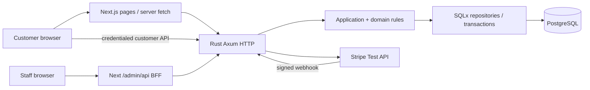
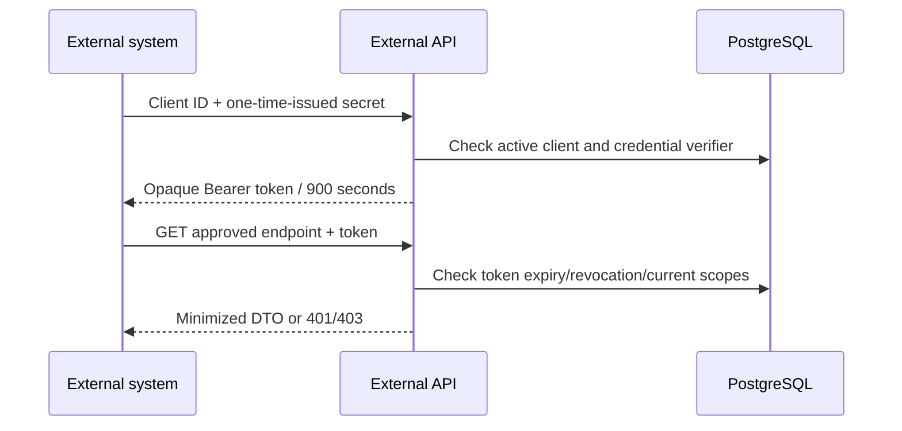
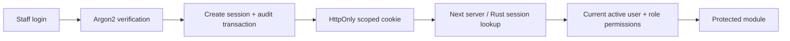

# X-Fly Anyway — Presentation Study Guide

## 1. X-Fly คืออะไรใน 30 วินาที

### เวอร์ชันสั้นมาก 10–15 วินาที

“X-Fly เป็นเว็บจองตั๋วสำหรับสายการบินพรีเมียมครับ ลูกค้าเลือกเที่ยวบิน เลือกที่นั่ง จ่ายแบบทดสอบ และรับ E-Ticket ได้โดยไม่ต้องสมัครสมาชิก ส่วนพนักงานกับเจ้าของเห็นข้อมูลตามหน้าที่ ไม่ใช่ทุกคนเป็นแอดมินที่ทำได้ทุกอย่างครับ”

### เวอร์ชันปกติ 30–45 วินาที

“ระบบนี้ดูแลตั้งแต่ค้นหาเที่ยวบิน Business หรือ First เลือกที่นั่งแบบโรงหนัง กรอกผู้โดยสาร จ่ายเงิน ไปจนถึงรับ E-Ticket และขอคืนเงินตามเงื่อนไขครับ จุดที่ผมให้ความสำคัญคือความถูกต้องเวลาหลายคนเลือกที่นั่งเดียวกัน กับการแยกสิทธิ์พนักงาน เจ้าของดูรายงานและผลดำเนินงานโดยประมาณได้ ส่วนระบบภายนอกต้องขอ token และมีสิทธิ์ตรงกับข้อมูลที่เรียก โครงการนี้เป็นระบบจองและออกตั๋ว ไม่ใช่ระบบเช็กอินหรืออนุญาตขึ้นเครื่อง และการชำระเงินยังเป็น Stripe Test กับ Bitcoin จำลองครับ”

### เวอร์ชันประมาณ 1 นาที

“โจทย์ของ X-Fly Anyway คือสายการบินสีเหลืองสำหรับลูกค้ากำลังซื้อสูงครับ ผมทำเว็บจองที่ไม่บังคับสมาชิก แต่หลังจองลูกค้ากลับมาดูข้อมูลด้วย Booking Reference และนามสกุลได้ การเลือกที่นั่งไม่ได้เปลี่ยนแค่สีในหน้าเว็บ มี server จองชั่วคราวและฐานข้อมูลป้องกันการขายซ้ำ การจ่ายเงินต้องยืนยันจากฝั่ง server ก่อนจึงรับเป็นรายการสำเร็จ ลูกค้าพิมพ์ E-Ticket ที่มี QR ลงลายเซ็นได้ และยกเลิกก่อนออกเดินทางอย่างน้อย 24 ชั่วโมงโดยไม่มีค่าธรรมเนียม ส่วนเจ้าของมีรายงานรายวัน รายสัปดาห์ รายเดือน ดู demand สัญชาติ และผลดำเนินงานจากต้นทุนประมาณการ พนักงานแต่ละฝ่ายใช้สิทธิ์แยกกัน ระบบอื่นเข้าผ่าน API ที่จำกัด scope ไม่เข้าฐานข้อมูลตรงครับ เรื่องดวงจันทร์เป็นวิสัยทัศน์การตลาด ส่วนเป้าหมาย 100,000 ยังไม่ใช่ผลความสามารถที่พิสูจน์แล้วครับ”

### อ่านคู่มือนี้อย่างไร

อ่านหัวข้อ 1 → 22 → 26 → หน้าสรุปท้ายเล่มก่อน แล้วใช้หัวข้อ 5–19 และ Q&A ซ้อมตอบคำถาม อย่าจำชื่อ library โดยไม่เข้าใจปัญหาที่มันแก้

**ขอบเขตหลักฐาน:** ตรวจ source tree วันที่ 20 กันยายน 2026, branch `fix/requirements-audit`, HEAD เมื่อเริ่ม `231d116d8c14aae9f71149925ce49b3fc20c22b2` รวมงาน API Admin ที่ยังไม่ commit ในตอนเริ่ม ไม่ได้ตรวจ live server/DEV database และไม่ได้รัน tests, build, migrations หรือ load test ใน audit นี้ คำว่า “มี test” หมายถึงพบ coverage ใน source ไม่ได้อ้างว่าเพิ่งรันทดสอบผ่าน

**สถานะก่อนเริ่ม:** มีไฟล์แก้ไขเดิม 5 ไฟล์และ migration ใหม่เดิม 2 ไฟล์ ได้แก่ CI, `database_lifecycle.rs`, `runtime_database_permissions.rs`, `ApiClientEditor.tsx`, `ApiClientManagement.test.tsx`, migrations `20260920000300` และ `20260920000400` คู่มือนี้ไม่เปลี่ยนไฟล์เหล่านั้น การมี migration ใน repository ไม่ได้ยืนยันว่า operator นำไปใช้ใน DEV/server แล้ว

**สถานะตอนตรวจจบ:** HEAD เปลี่ยนจากภายนอกงาน audit เป็น `c5a6a9fcd1dc7e5a3cfaffe40c4c5d7fba723853` (`fix: stabilize API client management runtime access`) ระหว่างทำงาน โดย commit ครอบคลุม 7 ไฟล์เดิมพอดี SHA-256 ของแต่ละไฟล์ยังตรง baseline ที่อ่านตอนเริ่ม ผู้ทำ audit ไม่ได้ stage/commit/เปลี่ยน branch และไม่ได้คืน Git state ย้อนกลับ งานที่สร้างโดย audit มีเพียงคู่มือนี้ สถานะ commit ไม่ได้พิสูจน์ deployment/migration บน DEV

### ดัชนีหลักฐานที่ใช้ในตาราง

เส้นทางด้านล่างอ้างอิงจาก root repository; รหัส S ใช้ย่อในตารางเพื่อให้อ่านง่าย

| รหัส | หลักฐานปัจจุบันและสิ่งที่ตรวจ |
|---|---|
| S01 | [frontend/package.json](../../frontend/package.json), [package-lock.json](../../frontend/package-lock.json): dependencies/scripts/เวอร์ชันจริง |
| S02 | [backend/Cargo.toml](../../backend/Cargo.toml), [Cargo.lock](../../backend/Cargo.lock), [main.rs](../../backend/src/main.rs): backend/runtime wiring |
| S03 | [HTTP routes](../../backend/src/infrastructure/http/mod.rs), [publicFlightBackend.ts](../../frontend/src/lib/flights/publicFlightBackend.ts), `frontend/src/app/(customer)/`: customer routes |
| S04 | [seat repository](../../backend/src/infrastructure/database/mod.rs), [seat_hold_repository.rs](../../backend/tests/seat_hold_repository.rs), migration `20260830000100`: inventory/hold/concurrency |
| S05 | [passenger domain](../../backend/src/domain/passengers.rs), [pricing](../../backend/src/domain/pricing.rs), [review DTO](../../backend/src/domain/review.rs), migration `20260907000200`: passenger/contact/pricing |
| S06 | [payment repository](../../backend/src/infrastructure/database/payment.rs), [Stripe adapter](../../backend/src/infrastructure/payment/stripe.rs), [reconciliation](../../backend/src/application/use_cases/reconcile_stripe_payment.rs), [payment tests](../../backend/tests/payment_repository.rs) |
| S07 | [cancellation repository](../../backend/src/infrastructure/database/cancellation.rs), [dispatcher](../../backend/src/application/cancellation.rs), [Stripe refund](../../backend/src/infrastructure/refund/stripe.rs), [refund tests](../../backend/tests/refund_rules.rs) |
| S08 | [Manage Booking repository](../../backend/src/infrastructure/database/manage_booking.rs), [access signature](../../backend/src/infrastructure/manage_booking/access.rs), [details UI](../../frontend/src/components/manage-booking/ManageBookingDetailsPage.tsx) |
| S09 | [ticket repository](../../backend/src/infrastructure/database/ticket.rs), [QR signature](../../backend/src/infrastructure/ticket/qr.rs), [verification use case](../../backend/src/application/use_cases/verify_ticket.rs), [ticket DTO](../../backend/src/domain/ticket.rs) |
| S10 | [CustomerETicket](../../frontend/src/components/manage-booking/CustomerETicket.tsx), [TicketVerificationQr](../../frontend/src/components/manage-booking/TicketVerificationQr.tsx), [print CSS](../../frontend/src/app/globals.css), [ManageBooking tests](../../frontend/src/tests/ManageBookingPage.test.tsx) |
| S11 | [staff domain](../../backend/src/domain/staff.rs), [RBAC migration](../../backend/migrations/20260906000200_create_staff_auth_rbac.sql), [admin HTTP](../../backend/src/infrastructure/http/admin/mod.rs), [staff auth](../../backend/src/application/staff_auth.rs) |
| S12 | [admin authorization](../../frontend/src/lib/admin/adminAuthorization.ts), [BFF](../../frontend/src/lib/admin/adminBackend.ts), [workspace](../../frontend/src/components/admin/shell/AdminWorkspace.tsx), `frontend/src/app/admin/` |
| S13 | [dashboard DTO/filter](../../backend/src/application/analytics.rs), [analytics SQL](../../backend/src/infrastructure/database/analytics.rs), [backend tests](../../backend/tests/admin_dashboard_http.rs) |
| S14 | [ExecutiveDashboard](../../frontend/src/components/admin/dashboard/ExecutiveDashboard.tsx), [DashboardDetail](../../frontend/src/components/admin/dashboard/DashboardDetail.tsx), [period helper](../../frontend/src/components/admin/dashboard/dashboardPeriods.ts), [filter UI](../../frontend/src/components/admin/dashboard/DashboardFilters.tsx), `ExecutiveDashboard.test.tsx`, `DashboardFilters.test.tsx` |
| S15 | [flight domain](../../backend/src/domain/flight.rs), [flight repository](../../backend/src/infrastructure/database/flight.rs), [cost migration](../../backend/migrations/20260920000200_add_modeled_operating_cost_to_flight_services.sql), [FlightEditor](../../frontend/src/components/admin/flights/FlightEditor.tsx), `admin_flights_http.rs`, `flight_management_repository.rs` |
| S16 | [booking operations](../../backend/src/infrastructure/database/booking_management.rs), [ticket operations](../../backend/src/infrastructure/database/ticket_operations.rs), `backend/tests/admin_bookings_http.rs`, `admin_tickets_http.rs`, `frontend/src/components/admin/bookings/`, `tickets/` |
| S17 | [API clients](../../backend/src/infrastructure/database/api_client.rs), [external auth](../../backend/src/infrastructure/database/external_auth.rs), [external domain](../../backend/src/domain/external_api.rs), [crypto](../../backend/src/infrastructure/external_auth_crypto.rs), [API Client UI](../../frontend/src/components/admin/api-clients/ApiClientEditor.tsx) |
| S18 | [external HTTP](../../backend/src/infrastructure/http/external.rs), [flight DTO](../../backend/src/application/external_flights.rs), [analytics DTO](../../backend/src/application/external_analytics.rs), [external analytics SQL](../../backend/src/infrastructure/database/external_analytics.rs), `backend/tests/external_*` |
| S19 | [provisioning](../../backend/provisioning/runtime_grants.sql), [roles](../../backend/provisioning/project_roles.sql), [lifecycle](../../backend/src/infrastructure/database/lifecycle.rs), [runtime tests](../../backend/tests/runtime_database_permissions.rs), [TEST guards](../../backend/tests/common/mod.rs) |
| S20 | [password hashing](../../backend/src/infrastructure/password/mod.rs), [staff repository](../../backend/src/infrastructure/database/staff_auth.rs), [browser security](../../backend/src/infrastructure/http/browser_security.rs), [config rules](../../backend/src/config.rs), `staff_security_audit.rs`, `external_security_http.rs`, `external_logging.rs` |
| S21 | [HomePromoCarousel](../../frontend/src/components/home/HomePromoCarousel.tsx), [EN](../../frontend/src/i18n/locales/en.ts), [TH](../../frontend/src/i18n/locales/th.ts), [network test](../../backend/tests/airport_network_master.rs), migration `20260907000600` |
| S22 | [i18n](../../frontend/src/i18n/LanguageProvider.tsx), `frontend/src/i18n/locales/`, [motion registry](../../frontend/src/lib/motion/gsap.ts), [reduced motion](../../frontend/src/lib/motion/reducedMotion.ts), `frontend/src/tests/` |
| S23 | [Branch 28 closeout](../../performance/reports/branch-28-closeout.md), [report interpretation](../../performance/reports/README.md), [harness](../../performance/README.md), `performance/k6/`, `performance/tests/` |
| S24 | [Compose](../../compose.yaml), [backend Dockerfile](../../backend/Dockerfile), [CI](../../.github/workflows/ci.yml): tracked runnable infrastructure |
| S25 | [DESIGN.md](../../DESIGN.md): ใช้เฉพาะข้อกำหนด/แผน/เหตุผล ไม่ใช่หลักฐาน deploy หรือ restore สำเร็จ; `BACKEND.md`, `DATABASE.md`, `FRONTEND.md` เป็นแนวทางกว้าง ไม่ใช่ inventory เทคโนโลยีของระบบ |
| S26 | `backups/` พบ local dump หนึ่งไฟล์จาก 10 กันยายน 2026; ตรวจเฉพาะชื่อ/ขนาด ไม่เปิดข้อมูล ไม่ restore; directory ถูก gitignore |

## 2. Requirement traceability matrix

`IMPLEMENTED` = มี implementation ใน source; `IMPLEMENTED WITH BOUNDARY` = มีแต่ต้องอธิบายข้อจำกัด; `PARTIAL` = ทำบางส่วน; `ARCHITECTURAL TARGET` = เป้าหมาย; `OUT OF SCOPE` = ไม่ทำในขอบเขตนี้; `NOT PROVEN` = ยังไม่มีหลักฐานพอ ทั้งหมดไม่ใช่การรับรอง live deployment

| Requirement | Current Status | Actual Implementation | Evidence | Demo? | Important Limitation |
|---|---|---|---|---|---|
| X-Fly Anyway / สีเหลือง / premium / กำลังซื้อสูง | IMPLEMENTED | brand ดำ-เหลือง-ขาว, Business/First UX | S21–22 | หน้าแรก | positioning ไม่ใช่ผลวิจัยรายได้ลูกค้า |
| เรื่องราวเครือข่าย 156 ประเทศ | IMPLEMENTED WITH BOUNDARY | master 156 ประเทศ/primary airports พร้อม search ที่อ่าน flight จริง | S21 | airport selector | ไม่ใช่มีทุกเส้นทางหรือทุกประเทศขายทุกวัน |
| Moon ปีหน้า | IMPLEMENTED WITH BOUNDARY | slide ที่ 4 “COMING NEXT YEAR” ไม่มี CTA จอง | S21 | ได้ | marketing vision ไม่ใช่ confirmed operation |
| จองผ่าน web | IMPLEMENTED | customer routes ตั้งแต่ search ถึง ticket | S03 | ได้ | ไม่มี native mobile app |
| ไม่ต้องสมัครสมาชิก | IMPLEMENTED | guest booking ไม่มี customer login | S03, S08 | ได้ | staff login เป็นอีกระบบหนึ่ง |
| ยืนยันตัวตนหลังจอง/คืนเงิน | IMPLEMENTED WITH BOUNDARY | reference + นามสกุล → signed scoped access cookie | S08 | ได้ | knowledge-based lookup ไม่ใช่ OTP/KYC; เก็บ reference เป็นส่วนตัว |
| คนเดียวจองหลายครั้ง | IMPLEMENTED | หลาย hold/payment/ticket ไม่ผูกข้อจำกัดหนึ่ง booking ต่อ account | S04–09 | อธิบาย | ไม่มีหน้า customer-account history |
| เลือกที่นั่งแบบโรงหนัง | IMPLEMENTED | seat map และ authoritative hold | S04 | ควรโชว์ | UI ไม่ใช่ผู้ตัดสินว่าใครได้ที่นั่ง |
| Business และ stakeholder override First | IMPLEMENTED | ใหม่ขายเพียง business/first | S04–05, S15 | ได้ | legacy economy ยัง parse/เก็บประวัติได้ |
| บัตรเครดิต | IMPLEMENTED WITH BOUNDARY | Stripe PaymentElement/PaymentIntent/webhook | S06 | Test เท่านั้น | ไม่ใช่ live merchant acceptance |
| Bitcoin concept | IMPLEMENTED WITH BOUNDARY | MOCK_BITCOIN และ simulated settlement/refund | S02, S06–07 | ถ้าจำเป็น | ไม่เข้า blockchain |
| ยกเลิกก่อนออก ≥24 ชั่วโมง | IMPLEMENTED | server ใช้ departure instant จาก origin timezone | S07 | prepared booking | ตรง 24 ชั่วโมงผ่าน; หลัง cutoff ไม่ผ่าน |
| ไม่มีค่าธรรมเนียม / คืนเต็ม | IMPLEMENTED WITH BOUNDARY | refund amount เท่าราคาจ่าย; fee 0 | S07–08 | อธิบาย/สถานะ | completed refund แยกจาก pending |
| เปลี่ยนเที่ยวบิน | IMPLEMENTED WITH BOUNDARY | ยกเลิกที่เข้าเกณฑ์แล้วจองใหม่ | S07–08 | พูด | ไม่มี exchange/rebooking transaction |
| E-ticket บนเว็บไซต์ | IMPLEMENTED | confirmation → Manage Booking → QR ticket | S08–10 | ควรโชว์ | booking-level document ไม่ใช่ boarding authorization |
| พิมพ์เอกสารเดินทาง | IMPLEMENTED WITH BOUNDARY | window.print, A4 CSS, QR | S10 | print preview | browser/paper/จำนวนผู้โดยสารยังต้อง QA |
| ตอบสนองราว 1 วินาที | IMPLEMENTED WITH BOUNDARY | isolated search/detail latency ต่ำกว่า 1s ในรายงาน | S23 | ใช้ตาราง | ไม่ใช่ SLA ทุกหน้า/การจ่ายเงิน/ทุก network |
| 100,000 concurrent users / RPS | ARCHITECTURAL TARGET | bounded load harness และแนว scale | S23, S25 | พูด | users กับ RPS คนละหน่วย; ยังไม่พิสูจน์ทั้งสอง |
| Cloud infrastructure | ARCHITECTURAL TARGET | แผนย้าย; current design ตั้ง demo self-hosted Ubuntu | S24–25 | diagram | ไม่พบ tracked full cloud deployment |
| backup / no-data-loss | PARTIAL | persistent volume และ local dump; แผน daily backup | S24–26 | พูด | restore/PITR/RPO/RTO/zero-loss ยังไม่พิสูจน์ |
| strong security | IMPLEMENTED WITH BOUNDARY | auth/RBAC/hash/HMAC/transactions/grants/origin checks | S11, S17–20 | scope denial | ไม่ใช่ security certification |
| desktop/tablet/mobile | IMPLEMENTED WITH BOUNDARY | responsive CSS/native scroll/controls | S10, S14, S21–22 | resize | ไม่ใช่รับรองทุก device/browser |
| เที่ยวบินกำไร/ขาดทุน | IMPLEMENTED WITH BOUNDARY | backend net revenue − modeled cost ต่อ scheduled service/date | S13–15 | provider ALL | ไม่ใช่ audited accounting profit |
| route planning จากผลประกอบการ | IMPLEMENTED WITH BOUNDARY | route revenue/filter + flight results ตาม route | S13–14 | ได้ | ไม่มี route P/L roll-up แยกหรือ forecasting |
| demand / เต็มหรือขายน้อย | IMPLEMENTED WITH BOUNDARY | booking ranking, recorded occupancy, low-demand list | S13–14 | ได้ | inventory ที่ materialized เท่านั้น ไม่ใช่ load factor ผู้ขึ้นจริง |
| destination/route filter | IMPLEMENTED | route code AAA-BBB; route options จาก DB | S13–14 | ได้ | ไม่ใช่ arbitrary geographic BI |
| time-period filter | IMPLEMENTED | from/to inclusive, ≤366 วัน | S13–14 | ได้ | cohort ของ revenue กับ profitability ต่างกัน |
| สัญชาติผู้โดยสาร | IMPLEMENTED | aggregate counts/percentages ไม่มีรายชื่อ/พาสปอร์ตใน dashboard | S13 | ได้ | ไม่ใช่ระบบส่ง personal marketing list |
| route/marketing planning | IMPLEMENTED WITH BOUNDARY | demand/revenue/nationality เพื่อช่วยตัดสินใจ | S13–14 | พูด | ไม่มี recommendation engine |
| Daily reports | IMPLEMENTED | Bangkok วันนี้ → วันนี้ | S14 | ได้ | ไม่ใช่ส่ง email อัตโนมัติ |
| Weekly reports | IMPLEMENTED | จันทร์ปัจจุบัน → วันนี้ | S14 | ได้ | ไม่ใช่ rolling 7 วัน |
| Monthly reports | IMPLEMENTED | วันที่ 1 → วันนี้ | S14 | ได้ | ไม่ใช่ rolling 30 วัน |
| Custom reports | IMPLEMENTED | manual From/To, validation เดิม | S13–14 | ได้ | ไม่มี PDF/CSV report export |
| booking/reservation staff | IMPLEMENTED WITH BOUNDARY | lookup/filter/detail/eligible cancellation | S16 | ได้ | ไม่ใช่ staff สร้าง booking ใหม่แทนลูกค้าทุกขั้นตอน |
| ticket/passenger staff | IMPLEMENTED WITH BOUNDARY | ticket lookup/detail/authorized print/seat assignment | S16 | ได้ | ไม่มี check-in/scanner/boarding |
| baggage staff/access | PARTIAL | role/limited permission catalog; flight read | S11–12, S16 | อธิบาย | ไม่พบ baggage workflow/limited-passenger endpoint; full booking/ticket denied |
| dedicated flight authority | IMPLEMENTED | flights:write โดย FLIGHT_MANAGER | S11, S15 | ได้ | structural edits ถูกป้องกันเมื่อมี instance |
| SYSTEM_ADMIN ไม่ได้แก้ flight อัตโนมัติ | IMPLEMENTED | permission check ไม่มี superuser bypass | S11, S15 | พูด/test | staff/role permissions ไม่เท่ากับมี staff CRUD UI แล้ว |
| company devices only | ARCHITECTURAL TARGET | policy ใน DESIGN; app auth/RBAC ไม่ตรวจ device trust | S20, S25 | พูด | MDM/VPN/device certificates ยังไม่พิสูจน์ |
| approved external data access | IMPLEMENTED WITH BOUNDARY | REST flight + nonfinancial aggregate analytics | S17–18 | token demo | ไม่มี booking/passenger/baggage endpoint |
| external credential/token authorization | IMPLEMENTED | one-time secret → 15-min token → current scope check | S17–18 | ควรโชว์ | ไม่ใช่ OAuth server ครบมาตรฐานทุก flow |
| external ไม่ต่อ PostgreSQL ตรง | IMPLEMENTED WITH BOUNDARY | HTTP API-only contract; DB localhost Compose | S18–19, S24 | diagram | live firewall/production network ต้อง operator ยืนยัน |
| least privilege/scopes | IMPLEMENTED | flights:read vs analytics:read, runtime column grants | S17–20 | 200/403 | ไม่ใช่ได้ token แล้วอ่านได้ทุกอย่าง |
| booking data ให้ marketing ที่อนุมัติ | PARTIAL | ส่งยอดรวม nonfinancial analytics | S18 | ได้บางส่วน | raw bookings/contact/passenger feeds ยังไม่มี |
| ไม่มี chatbot | OUT OF SCOPE | ไม่พบ customer-support module | S03, S12 | ไม่ | ไม่ใช่ระบบช่วยเหลือลูกค้าครบวงจร |
| ไม่มี loyalty/points | OUT OF SCOPE | guest model ไม่ทำ points | S03–09 | ไม่ | ไม่ใช่ membership platform |
| ไม่มี promotion/campaign builder | OUT OF SCOPE | carousel static config เท่านั้น | S21 | แสดง boundary | badge ไม่ใช่ discount/pricing engine |
| legal/privacy/security considerations | IMPLEMENTED WITH BOUNDARY | minimize fields, permissions, secrets, test payments | S18–20, S25 | พูด | universal legal compliance/certification = NOT PROVEN |

## 3. ความสามารถปัจจุบัน แยกตาม domain

ทุกแถวบอกทั้งสิ่งที่ผู้ใช้ทำได้ กฎ วิธีทำ และจุดที่ไม่ควรอ้างเกินจริง

| พื้นที่ / ผู้ใช้ | ทำอะไรได้ | กฎและเทคนิคสำคัญ | ข้อจำกัด |
|---|---|---|---|
| Customer Web / ลูกค้า | ดู brand/story/campaign EN/TH แล้วเริ่มจอง | Next App Router, reusable UI, responsive motion [S01,S21] | ไม่มี account; Moon ไม่มีการขาย |
| Flight Search / ลูกค้า | เลือก origin/destination/date/cabin/passenger counts | อ่าน airport master; backend ตรวจ customer horizon วันนี้ถึง +365 วันตาม origin local date [S03,S04] | master airport ไม่ได้สร้าง schedule ให้เอง; ไม่มีผลลัพธ์ต้องบอกว่าง |
| Results / Detail / ลูกค้า | เปรียบเทียบ flight จริง ดูเวลา/เครื่อง/cabin/fare | server fetch public API, no-store, typed DTO [S03,S15] | ไม่ใช้ fixture fallback แอบอ้าง availability; ค้นหาเป็นเที่ยวบินตามวัน ไม่ใช่ interline engine |
| Seat Selection / Hold / ลูกค้า | คลิกที่นั่ง ดู unavailable/selected และแก้ชุดที่นั่ง | transaction + row locks; default hold 600 วินาที; server expiry; replace แบบ atomic [S04] | countdown ใน UI เป็นตัวช่วย; expired Stripe ที่ยังไม่ทราบผลมี protection เฉพาะ |
| Passenger / Travel Document / ลูกค้า | กรอกผู้โดยสาร/สัญชาติ/passport/phone contact | validation frontend และ backend; passport dates optional; new booking contact phone-only [S05] | ไม่ส่ง email; ไม่ใช่การตรวจเอกสารโดย ตม.; infant ไม่ใช้ seat |
| Review / ลูกค้า | ตรวจผู้โดยสาร flight seats และราคาก่อนจ่าย | server snapshot fare + demo tax/fee; exact integer arithmetic [S05] | tax/fee เป็น demo fixtures ไม่ใช่อัตรากฎหมายทุกประเทศ |
| Payment / ลูกค้า | Stripe Test Card หรือ Mock Bitcoin | request id/fingerprint, provider reference, webhook/reconciliation [S06] | ไม่ใช่ live money/blockchain |
| Confirmation / ลูกค้า | รับสถานะสำเร็จ เก็บ/copy reference ไป Manage Booking | ticket issuance ตรวจ successful finalized payment [S09] | อย่าปิดก่อนบันทึก reference; ไม่ส่ง email ยืนยัน |
| Manage Booking / ลูกค้า | reference + last name, ดู booking/ticket/refund, eligible cancel | backend lookup กับชื่อผู้โดยสารใน booking; access cookie 30 นาที [S08] | ไม่ใช่ login account; ผู้รู้ทั้งสองค่ามีความสามารถเข้าถึง จึงไม่ใช่ strong identity proof |
| E-Ticket / QR / ลูกค้า | ดู boarding-pass-inspired document และพิมพ์ | signed ticket identifier; public verification returns limited facts [S09–10] | ไม่มี gate/terminal/check-in; passenger list/seat list ใน customer DTO แยกกัน ห้ามตีความจับคู่เอง |
| Cancellation / Refund / ลูกค้าและ Booking Operations | cancel eligible booking, ดู pending/completed/attention | atomic ticket/seat changes + persisted refund job [S07,S16] | ยกเลิกสำเร็จไม่ได้แปลว่า provider refund เสร็จทันที |
| Staff auth / ทุก staff | เข้าระบบด้วยบัญชีที่ provision ให้, logout | Argon2id, opaque DB-backed session, current permissions [S11,S20] | ไม่ใช่เปิดลงทะเบียนเอง; no device attestation |
| Executive reports / Owner | KPI, periods, rankings, nationality, profitability | PostgreSQL aggregate, typed response, charts เป็น presentation [S13–14] | model ไม่ใช่บัญชี; refund/date/provider ต้องอ่าน qualifier |
| Flight Management / Flight Manager; read-only ตามสิทธิ์ | list/create/edit/cancel service, configure Business/First และ cost | version conflict, transaction/audit, structural dependency protection [S15] | aircraft เป็น code/template ไม่ใช่ fleet maintenance; cancellation ไม่ใช่ mass rebooking engine |
| Booking Operations / reservation staff | ค้นหา/กรอง booking, ดู detail, cancel ตาม policy | protected POST search ไม่เอาชื่อผู้โดยสารไป query URL; audit mutation [S16] | ไม่ได้แก้ผู้โดยสาร/payment/fare ตามใจ |
| Ticket / Passenger Operations | ค้น ticket/ผู้โดยสาร ดู assignments และ print | tickets:read + passengers:read; print ต้อง tickets:print [S11,S16] | read/print ไม่ใช่ boarding lifecycle |
| Baggage boundary | login และอ่าน flight ตาม flights:read | limited permission codes มีจริง; full modules reject [S11–12] | ยังไม่มี baggage loading/tag/tracking หรือ limited-passenger workspace |
| API Client Management / API Admin | register, filter, inspect, scopes, status, issue/revoke secret, audit | versioned mutations, current credential metadata, localized error mapping [S17] | persisted description ไม่ถูกแปล; runtime grants ต้องพร้อม |
| System Administration boundary | แยก identity/access authority ไว้ใน RBAC | CLI `staff_admin bootstrap\|create`; hidden password prompt [S11–12,S20] | ไม่พบ `/admin/staff` CRUD ที่เปิดใช้; ไม่ใช่ universal admin |
| External REST / approved systems | flight reference และ aggregate summary | opaque short-lived token + scope + minimized DTO [S18] | ไม่มี direct DB; ไม่มี passenger/baggage API |
| Persistence | เก็บสัมพันธ์ flight/hold/payment/ticket/audit | PostgreSQL constraints, locks, transactions, SQLx pool [S04,S19] | connection pool ไม่ทำให้รองรับไม่จำกัด |
| Security / audit | ป้องกัน unauthorized access และเก็บเหตุการณ์เฉพาะ | parameterized SQL, scoped cookies, safe diagnostics, least privilege [S19–20] | audit ไม่ใช่ log ทุก action; ไม่มีหลักฐาน pentest/certification |
| Performance | มี TEST-only public read load harness | k6 + host/DB observations + honest renderer [S23] | ไม่ทดสอบเต็ม customer payment flow ที่ 100,000 |
| Deployment | Compose DEV/TEST DB + backend Dockerfile + CI | DB loopback; nonroot backend image [S24] | full self-hosted/cloud stack เป็นแผน ยังไม่พิสูจน์ใน audit |
| Backup/recovery | มี volume และ local dump artifact | documented pg_dump/restore planning [S24–26] | ไม่มีหลักฐาน restore drill/zero loss |
| Localization / responsive / a11y | EN/TH, semantic controls, reduced motion, print | typed translations, locale dates, tests, native mobile snap [S10,S22] | free-form DB textไม่แปลอัตโนมัติ; ไม่มี WCAG certification |

### กฎย่อยที่ควรรู้เวลาเปิดหน้าจอจริง

- Passenger counts ต้องมี adult อย่างน้อยหนึ่งคน, infant ไม่เกิน adults, adults+children ไม่เกิน 9; infant ไม่ใช้ seat ตาม `backend/src/domain/value_objects/mod.rs` ไม่ใช่ passenger-seat assignment จากการเดาลำดับใน frontend
- Flight Editor จัด flight number, origin/destination, operating date, departure/arrival time/day offset, aircraft code, Business/First fare/capacity และ modeled cost ค่า schedule/route ต้องใช้ airport timezones; capacity เป็นรูปแบบ template ที่ domain ยอมรับ ไม่ใช่ออกแบบ cabin ตามใจได้ทุกจำนวน
- Structural changes คือ flight number/route/date/times/day offset/aircraft/capacity; หากมี materialized flight instance แล้ว repository ปฏิเสธ แม้ยังไม่มี paid booking เพราะ inventory dependency ก็สำคัญ Cost ไม่อยู่ใน structural comparator จึงแก้ cost-only ได้เมื่อ scheduled/version/permission ถูกต้อง พร้อม audit
- Fare updates เป็น non-structural ตาม implementation ปัจจุบัน ไม่ควรพูดว่า fare ถูกห้ามแก้ทุกกรณี ระบบยังเก็บ authoritative review/payment snapshots; cost-only submission ไม่ได้หมายถึงสิทธิ์แก้ booked seat/schedule [S15]
- Cancel flight service เปลี่ยน service status/history และ public availability ไม่ใช่ปุ่ม cancel ทุก booking/คืนเงินทั้งเครื่องอัตโนมัติ [S15,S07]

## 4. Stakeholder map และ least privilege

สิทธิ์ effective คือผลรวม permission ของ roles ที่บัญชีได้รับใน DB ปัจจุบัน ตารางนี้เป็น canonical grants จาก migration ไม่ใช่แค่เมนูที่มองเห็น [S11]

| Stakeholder | What they need | What X-Fly provides | What they cannot do |
|---|---|---|---|
| Customer | จอง/ตั๋ว/คืนเงิน | guest flow, scoped hold, reference lookup | staff reports, flight writes, อ่าน booking อื่นโดยไม่มี lookup credentials |
| Executive / Owner | ตัดสินใจทางธุรกิจ | `dashboard:read`, `analytics:read`, `reports:read` | ไม่ได้ flight write หรือ passenger operational detail โดย role นี้ |
| Flight Manager | บริหารเที่ยวบิน | `flights:read`, `flights:write` | ไม่ได้ payment/refund/customer record authority จาก role นี้ |
| Booking Operations | ช่วยเรื่องรายการจอง | `bookings:read`, `bookings:manage` | ไม่ได้แก้ flight หรือเข้ารายงานผู้บริหาร |
| Ticket / Passenger Operations | ตรวจผู้โดยสารและเอกสาร | `tickets:read`, `tickets:print`, `passengers:read` | ไม่ได้ cancellation management หรือ check-in |
| Baggage Staff | ข้อมูลเท่าที่เกี่ยวข้อง | `flights:read`, `bookings:read_limited`, `passengers:read_limited`, `baggage_context:read` | limited codes ยังไม่มี dedicated workflow; ห้ามอ้างว่าอ่าน full booking/contact/passport/payment ได้ |
| API Admin | อนุมัติการเชื่อมระบบ | `api_clients:read`, `api_clients:manage` | ไม่ได้ Executive/flight/booking/ticket privilege |
| System Admin | authority ด้าน identities/roles | `staff:read`, `staff:manage`, `roles:read`, `roles:manage`; provisioning CLI มีจริง | ไม่มี implicit business permissions; ไม่มี staff web CRUD ที่เปิดใช้ |
| External Flight-data System | ตาราง/ข้อมูล flight reference | token ที่มี `flights:read` | ไม่ได้ passenger/seat ownership/internal UUID/cost |
| External Marketing / Analytics | aggregate demand | token `analytics:read` เรียก summary | ไม่ได้ contact list, raw bookings, revenue/profitability |
| Downstream airport/baggage systems | เชื่อมข้อมูลที่อนุมัติ | ใช้ external endpoints ที่มีจริงได้ตาม scope | ยังไม่มี baggage/check-in/gate API; downstream scope เป็นแนวทาง ไม่ใช่ integration สำเร็จแล้ว |

ตอบอาจารย์: “ผมแยกสิทธิ์ตามหน้าที่ครับ คนดูยอดขายไม่จำเป็นต้องแก้เที่ยวบิน และคนดูตั๋วไม่จำเป็นต้องคืนเงิน การแยกนี้ลดความผิดพลาดและลดผลกระทบถ้าบัญชีหนึ่งถูกใช้ผิดครับ”

## 5. Tech stack ที่พบจริง

เวอร์ชัน frontend ด้านล่างมาจาก lockfile ไม่ใช่เดาจาก caret range; backend จาก Cargo.lock ยกเว้น Rust toolchain ซึ่งดู CI/Dockerfile แล้วพบต่างเวอร์ชัน

### Frontend

| เทคโนโลยี / เวอร์ชัน | คืออะไร / ใช้ตรงไหน / แก้ปัญหาอะไร |
|---|---|
| Next.js 16.3.4 | React framework; App Router แยก customer/staff, server fetch flights, protected pages และ `/admin/api` BFF; จัด routing กับ server/browser boundary ใน project เดียว |
| React 19.2.8 | component/state model สำหรับ seat selection/forms/dashboard; เปลี่ยนเฉพาะส่วนตาม state แทนจัด DOM มือทั้งหมด |
| TypeScript 5.9.3 | ตรวจรูปแบบ DTO/props/translation keys ก่อนรัน; ลดการส่ง field ผิด แต่ไม่แทน runtime validation |
| Tailwind CSS 4.3.3 | utilities สำหรับ breakpoint, layout, print, focus; ร่วมกับ CSS เฉพาะ dashboard/staff และ design tokens |
| Radix UI เช่น Dialog 1.1.23 | accessible primitives สำหรับ dialog/select/tabs/tooltip; project มี wrappers ใน `components/ui` ไม่ควรอ้างว่าติดตั้ง shadcn package หรือใช้ทุก component ของ shadcn |
| GSAP 3.15.0 + @gsap/react 2.1.2 | timeline/animation lifecycle; registry มี ScrollTrigger และ Flip; storytelling และ layout transitions ไม่ใช่ business logic |
| Lenis 1.3.26 | smooth-scroll provider เชื่อม motion; มี reduced-motion/fallback coverage ไม่ใช้แทนทุก native interaction |
| Motion 13.1.1 | animations ใน SeatButton, CountrySelect, CabinExperience และ demo component |
| SplitType 0.3.4 | split text เพื่อ animation ใน SplitText; ไม่ใช่ตัวแปลภาษา |
| Stripe React 5.6.1 / stripe-js 8.11.0 | Elements/PaymentElement รับรายละเอียดบัตรผ่าน Stripe; Next ไม่เก็บเลขบัตรเอง |
| qrcode.react 4.2.0 | render QR SVG จาก verification URL เดิม; ไม่ใช่ผู้สร้าง signature |
| Lucide React, clsx, CVA, tailwind-merge | icons และประกอบ variants/classes ให้ component สม่ำเสมอ |
| Intl + typed local dictionaries | EN/TH, date/number/currency formatting, Bangkok report calendar; ไม่ใช้ external translation service |
| Custom SVG charts | `DashboardCharts.tsx` สร้าง dashboard visualization เอง; ไม่พบ Recharts ใน dependencies ปัจจุบัน |

ไม่พบ React Hook Form, Zod, TanStack Query หรือ Recharts ใน package ปัจจุบัน จึงไม่ควรใส่ในสไลด์ tech stack เพียงเพราะเคยอยู่ในแผน

### Backend

| เทคโนโลยี | คำอธิบายสำหรับพูด |
|---|---|
| Rust, edition 2021 | ภาษาของ business rules/API; type system และ ownership ช่วยลดข้อผิดพลาดด้าน memory/state ไม่ได้แปลว่าไม่มี bug |
| Toolchain: CI 1.98.0; Docker builder 1.89 | repository ยังมี version mismatch; audit ไม่ได้ build image จึงห้ามอ้างว่า Docker artifact ล่าสุดผ่าน CI toolchain เดียวกัน |
| Axum 0.8.9 | รับ HTTP, route, extract request, middleware และแปลงผลลัพธ์เป็น response |
| Tokio 1.53.1 | async runtime ให้ server รอ DB/payment network โดยไม่ต้องกันหนึ่ง thread ค้างต่อ request; มี refund polling task |
| SQLx 0.8.6 | connection pool, transactions, parameter binding, migration engine; queries หลายจุดเป็น `query_as` runtime ไม่ควรอ้าง compile-time SQL verification ทุกคำสั่ง |
| serde 1.0.229 + serde_json | map Rust structs ↔ JSON และ enforce request shape ใน DTO บางตัว |
| chrono 0.4.45 | date/time arithmetic; PostgreSQL timezone conversion ใช้กับ flight departure |
| reqwest 0.12.28 + rustls | server เรียก Stripe ผ่าน HTTPS; ไม่ได้ใช้ Stripe Rust SDK เป็นแกน |
| Argon2 0.5.3 | hash password แบบใช้ memory/เวลา; random salt ต่อ hash |
| hmac + sha2 + subtle + rand + hex | QR/access signature, credential verifier, token hash, constant-time compare, random secret; แต่ละชนิดมีหน้าที่ต่างกัน |
| uuid | internal identities/request IDs; ไม่ใช่ตัวพิสูจน์สิทธิ์ด้วยตัวเอง |
| tracing 0.1.44 / tracing-subscriber / tower-http 0.6.11 | request diagnostics, request IDs, CORS และ middleware; ต้องรักษาขอบเขตไม่ log secrets |
| thiserror / async-trait / rpassword / dotenvy | typed errors, async repository interfaces, hidden CLI password prompt, config loading; ไม่โชว์ config values ใน demo |

### Database

PostgreSQL 18 เป็น relational database ใน Compose/CI เหมาะกับข้อมูลที่ต้องเชื่อมกันและเปลี่ยนพร้อมกัน เช่น payment สำเร็จต้องทำให้ hold consumed และ seat booked สอดคล้องกัน ไม่ใช่เลือกเพราะ “เร็วที่สุด”

- **Schema/migrations:** SQL migrations เพิ่มทีละขั้น; ปัจจุบันมี 32 migration files รวม 2 ไฟล์ที่ uncommitted ตอนเริ่มและถูก commit จากภายนอกงาน audit ระหว่างตรวจ ไม่ใช่หลักฐานว่า live database มี 32 แล้ว
- **Constraints:** foreign keys, unique service/date, unique ticket/payment, seat ownership, nonnegative amounts, bounded status ป้องกันข้อมูลผิดแม้หลุดจาก UI
- **Transactions/locks:** commit ทั้งชุดหรือ rollback; lock inventory ก่อนตัดสินใจ ลด double booking
- **Indexes:** inventory/hold expiry/search/trigram/staff-session/analytics indexes เพื่อ query ที่ใช้จริง ไม่ใช่ใส่ index แล้วทุกงานเร็ว
- **Pool:** API `main.rs` กำหนด max connections 10 ต่อ process; concurrency ของ HTTP ไม่เท่าจำนวน DB connections
- **Identities:** migrator จัด schema; runtime ใช้ grants เฉพาะงาน ไม่เป็น owner/superuser; บางตารางมี DELETE ที่จำเป็นต่อ replace/cleanup จริง จึงห้ามพูดว่า runtime ไม่มี DELETE ทุกตาราง
- **DEV/TEST:** DEV persistent port 5433; disposable TEST port 5434/tmpfs; tests ไม่ fallback ไป DATABASE_URL และปฏิเสธ DB `x_fly`/port 5433 [S19,S24]

### Infrastructure / DevOps

| สิ่งที่ตรวจ | สถานะหลักฐาน |
|---|---|
| Docker Compose | มี runnable PostgreSQL DEV/TEST services จริง ไม่ใช่ full app stack ใน compose ปัจจุบัน |
| Backend Dockerfile | multi-stage Rust → Debian slim, nonroot, healthcheck; toolchain เก่ากว่า CI ต้องระวัง |
| GitHub Actions | pinned action SHAs; repository checks, Rust build/clippy/audit/tests, frontend tests/lint/typegen/typecheck/build/npm audit; ไม่พบ deploy job |
| Nginx / Named Cloudflare Tunnel / Ubuntu / TLS / UFW / SSH | มีรายละเอียด target deployment ใน DESIGN แต่ไม่พบ tracked Nginx/cloudflared/systemd/UFW runtime configuration หรือหลักฐาน live status ใน audit นี้ |
| Cloud scale | architectural direction ยังไม่ใช่ deployed autoscaling/managed database/HA cluster |

### Testing / Quality และ external services

Rust tests มี domain/unit, HTTP, repository, concurrency, runtime permission และ migration lifecycle; frontend ใช้ Jest 30.4.2 + jsdom + Testing Library; มี lint/typecheck/build แยกกัน CI ใช้ cargo-audit 0.22.2 และตรวจ reachability ของ RustSec exception (`rsa`/`sqlx-mysql`) ไม่ควรพูดว่า “ไม่มี advisory ใดเลย” โดยไม่อ่านผล run

k6 ใช้วัด public reads ใน TEST ไม่ได้พิสูจน์ browser rendering; manual browser QA ยังจำเป็นสำหรับ scroll/touch/print ไม่มีหลักฐาน Playwright full E2E suite ใน dependency inventory นี้ Stripe Test เป็น external provider ที่ wiring ใช้จริง; Bitcoin เป็น local mock; มี Resend/email legacy code แต่ `main.rs` ไม่ wire confirmation-email service เป็น active booking flow [S01–02,S23–24]

## 6. Architecture: เข้าใจด้วยภาพเดียวก่อน

แบบภาษาคน: หน้าเว็บรับความต้องการ → server ตรวจว่าใครทำได้และข้อมูลถูกหรือไม่ → database ตัดสินใจเปลี่ยนข้อมูลอย่างเป็นชุด → เว็บแสดงผลที่ server ยืนยัน ไม่ให้ browser ประกาศเองว่าจ่ายแล้วหรือได้ที่นั่งแล้ว



รายละเอียด: ไม่ใช่ customer ทุก request ผ่าน BFF เหมือน staff; public flight server helpers fetch backend ส่วน customer clients เรียก configured API โดย cookie ตามขอบเขต Staff BFF allowlist paths/headers/cookie และใช้ private no-store แต่ Rust ยัง authorize ซ้ำเสมอ Repository traits แยก use case จาก HTTP/DB adapter จึงทดสอบ rule และ infrastructure แยกได้ [S02–03,S12]





## 7. Data model ที่ต้องอธิบายได้

**ไม่มีตารางชื่อ `bookings` เป็นแกนแยกใน model นี้:** booking สำเร็จประกอบจาก payment attempt + hold/passengers/seats + ticket/reference อย่าชี้ ERD ที่สร้างตามความคุ้นเคยแทน schema จริง [S04–09]

| Entity/table จริง | เก็บอะไร / ทำไมแยก | ความสัมพันธ์และ invariant |
|---|---|---|
| supported_countries / airports | ประเทศและสนามบินพร้อม timezone | master 156 primary airports; airport selection ไม่ใช่ flight availability |
| flight_services | นิยาม flight, route codes, schedule, aircraft, status/version, operating_date, modeled cost | managed service มีวันบิน; legacy service อาจไม่มี operating_date |
| flight_service_cabins | fare ต่อ cabin ของ service | Business/First ใหม่; legacy cabin rows ยังมีได้ |
| aircraft_seat_templates / flight_service_seat_templates | โครงที่นั่งก่อน materialize | template ไม่ใช่ seat ที่ถูกซื้อ; managed template ของ service แยกจาก legacy aircraft template |
| flight_instances | service + departure_date | unique service/date; concrete flight inventory |
| flight_seats | physical seat ใน instance, sellable/status/hold ownership | unique seat identity ต่อ flight; booked state ต้องสอดคล้องกับ ownership |
| seat_holds | ชุดที่นั่ง/จำนวนผู้โดยสาร/cabin/access hash/expiry | temporary ownership; released กับ consumed ไม่อยู่พร้อมกัน |
| hold_passengers | ordinal/identity/nationality/document/optional dates | belongs to hold; infant ไม่กิน seat; ไม่ใช่ customer account |
| booking_contacts | phone และ preferred locale ต่อ hold | current new booking phone-only; legacy columns ไม่เท่ากับ active email feature |
| hold_review_pricing | authoritative pricing snapshot | payment ใช้ snapshot ไม่รับ grand total จาก client |
| hold_extras | historical selections | ไม่มี active extras route/API ใน main router; อ่านประวัติได้ |
| payment_attempts | request id/fingerprint/provider/status/amount/ref/reference | request retry กับ payment attempt ไม่ใช่ transaction ใหม่ทุก click |
| payment_attempt_seats | finalized seat ownership + passenger_ordinal | unique active seat ownership; association เป็น backend record ไม่ควร zip arrays ใน UI |
| tickets | one booking-level ticket/payment, reference, ticket number, issued/cancelled | unique payment ticket; ไม่ใช่ boarding record |
| booking_cancellations | cancellation และ durable refund state/job/lease/retry | one cancellation per relevant booking; successful payment history ไม่ถูกลบ |
| stripe_webhook_events / stripe_refund_events | provider event deduplication | repeated delivery ไม่ทำ business transition ซ้ำ |
| staff_users / roles / permissions / joins | staff identity และ many-to-many authorization | ไม่มี customer members; current permission union |
| staff_sessions / staff_login_throttles | hashed session token, expiry/revoke; bounded login failures | raw session token ไม่เก็บใน DB |
| api_clients / api_scope_catalog / api_client_allowed_scopes | external organization/system identity และ approved scopes | staff role กับ API scope เป็นคนละ namespace/credential flow |
| api_client_credentials / external_access_tokens | credential verifier และ token hash/expiry/revoke | one-time plaintext secret; token ไม่เก็บ plaintext |
| flight_management_audit / booking_operations_audit / api_client_management_audit / staff_security_audit | before/after หรือ narrow security events | history ไม่ใช่ permission bypass; staff security runtime insert-only ตาม column grants |
| booking_confirmation_email_outbox | legacy email infrastructure | มี table ไม่ได้แปลว่าระบบใหม่ส่ง email; main ไม่มี active email wiring |

```mermaid
flowchart LR
  Search[Search service/date] --> Instance[Flight instance + seats]
  Instance --> Hold[Hold + access cookie]
  Hold --> Passenger[Passenger + phone]
  Passenger --> Review[Server pricing snapshot]
  Review --> Payment[Payment attempt]
  Payment -->|authoritative success| Final[Consumed hold + booked seats]
  Final --> Ticket[Ticket + booking reference]
  Ticket --> Manage[Reference + last name]
  Manage -->|eligible cancellation| Cancel[Cancelled ticket + released seats]
  Cancel --> Refund[Durable refund state]
```



ราคาหลักและ modeled cost ใช้ `i64`/PostgreSQL BIGINT **หน่วยบาทเต็ม THB** ไม่ใช่ floating-point และไม่ใช่ satang ภายในทุกตาราง Stripe adapter คูณ 100 แบบตรวจ overflow เพื่อส่ง satang; ค่าเปอร์เซ็นต์/ค่าเฉลี่ยบาง DTO เป็น float เพื่อ presentation จึงอย่าพูดว่า “ทั้งระบบไม่มี float” [S05–07,S15]

## 8. Payment: อะไรจริง อะไรจำลอง

### Stripe Test Mode

จริงในแง่การเชื่อม protocol: frontend ใช้ Stripe Elements, backend สร้าง PaymentIntent ผ่าน Stripe API, ตรวจ signed webhook และ server-side reconciliation; config ยอมรับ test secret ไม่ยอมรับ live key จึงเป็นเงินทดสอบเท่านั้น [S06,S20]

Browser success screen ไม่ใช่หลักฐานสุดท้าย เพราะผู้ใช้ปิดหน้า/แก้ state/เจอ network timeout ได้ Backend เช็ก provider reference, amount, currency และ allowed transition ก่อน finalize inventory ใน transaction เมื่อสำเร็จ hold consumed/seat booked แล้วจึงออก ticket อย่าง idempotent

Webhook อาจมาช้าหรือส่งซ้ำ มี event deduplication และ row locks; polling/reconciliation อาจแข่งกับ webhook จึง reload authoritative state ไม่สร้าง PaymentIntent ใหม่เพื่อเดาผล รายการ Stripe ที่ยัง unresolved จะคุ้มครอง inventory แม้ hold หมดเวลา จนได้ terminal result จาก provider; deadline ไม่ใช่ใบอนุญาตให้ปล่อยที่นั่งโดยเดาเอง

PaymentIntent creation ใช้ idempotency key ฝั่ง provider และ request id/fingerprint ฝั่งระบบ; refunded booking ยังคง payment SUCCEEDED เป็นประวัติ ไม่เปลี่ยนเป็น FAILED เพื่อให้กราฟลดลง X-Fly ไม่จัดเก็บ PAN/CVC/card expiry จากฟอร์มตนเอง แต่ยังมีหน้าที่ดูแลข้อมูลส่วนบุคคลและ integration security ไม่ใช่พ้นภาระทั้งหมดเพราะใช้ Stripe

ข้อจำกัด recovery ที่ควรพูดให้แม่น: current ticket route เรียก `get_ticket` → repository `issue_ticket` แบบ idempotent หลังตรวจ finalized payment; payment webhook เองไม่ใช่ active email/ticket-delivery service. ถ้าปิดเว็บก่อนเข้าสู่ ticket retrieval และก่อนรู้ reference ต้องกลับเข้าทาง authorized hold/attempt recovery ที่ยังใช้ได้ ไม่รับประกันการกู้คืนเมื่อไม่เหลือ access context และไม่อ้างว่ามี staff UI ออก ticket แทนได้ทุกกรณี ห้ามสัญญาว่า reference ถูกส่งให้ลูกค้าอัตโนมัติเสมอเมื่อ webhook สำเร็จ [S03,S09]

### Mock Bitcoin

แสดง payment method/สถานะ/การแปลงหน่วยและ simulation สำหรับโจทย์วิชา ใช้ integer/satoshi arithmetic มี demo rate ไม่เชื่อม wallet/node/mempool/confirmations และไม่ใช่ live blockchain settlement หรือราคา BTC ตลาดปัจจุบัน

| คำถาม | คำตอบธรรมชาติ |
|---|---|
| เงินจริงไหม? | “ไม่ใช่เงินจริงครับ แต่ส่วนบัตรเชื่อม Stripe Test API จริง ผมใช้เพื่อพิสูจน์ขั้นตอนสร้างรายการ รับผล และคืนเงินโดยไม่เสี่ยงเงินจริง” |
| ปิดเว็บตอนจ่ายเกิดอะไรขึ้น? | “รายการยังอยู่ฝั่ง server ครับ ผลไม่ได้ขึ้นกับหน้า success อย่างเดียว มี webhook และการตรวจสถานะกับ provider แต่ก่อน demo ผมเตรียม reference/รายการตัวอย่างไว้ ไม่รับปากว่า browser ที่ปิดก่อนบันทึกรหัสจะค้นคืนได้โดยไม่มีข้อมูลเลย” |
| ทำไม webhook? | “ผู้จ่ายไม่ควรเป็นผู้ประกาศเองว่าจ่ายแล้วครับ ให้ Stripe แจ้ง server แล้วตรวจลายเซ็นและยอด จึงลดการเชื่อผลจาก browser ที่ผิดหรือถูกแก้ได้” |
| ทำไมไม่เก็บเลขบัตร? | “เราเป็นระบบจอง ไม่ใช่ผู้ประมวลผลบัตรครับ ส่งข้อมูลบัตรผ่านผู้ให้บริการช่วยลดข้อมูลเสี่ยงที่ระบบต้องถือ และลดงานด้านมาตรฐานบัตร แต่ไม่ใช่การรับรอง compliance อัตโนมัติ” |
| Bitcoin จริงหรือเปล่า? | “เป็น mock ครับ แสดง flow ของอีกช่องทางชำระเงิน ไม่ได้เคลมว่าส่งเหรียญหรือยืนยันบล็อกจริง” |

## 9. Cancellation / Refund

นโยบายจาก code คือ `now <= departure_at - 24 hours` โดย departure_at มาจาก `instance.departure_date + service.departure_time` แปลงด้วย `origin_time_zone` ใน PostgreSQL ไม่อาศัยเวลาคอมลูกค้า และไม่ใช้ Bangkok timezone แทนทุกสนามบิน [S07–08]

กรณี eligible: ticket → CANCELLED, payment-seat ownership → released, flight seats → AVAILABLE และสร้าง cancellation/refund job เป็น transaction เดียว ค่าธรรมเนียม 0 ยอดคืนเต็ม payment amount ระบบไม่ลบหลักฐานการชำระเงินเดิม

Refund ไม่ใช่ขั้นตอนเดียวกับ cancel: PENDING → IN_FLIGHT/PROCESSING → SUCCEEDED หรือ REQUIRES_ATTENTION มี worker polling, lease token, `FOR UPDATE SKIP LOCKED`, stable refund idempotency key และ bounded retry สูงสุด 6 attempts; transient error retry ด้วย backoff ส่วน permanent/หมด retry แสดงต้องดูแล ไม่แอบบอกว่าได้เงินแล้ว

Stripe refund ใช้ Test API เช่นกัน; Mock Bitcoin refund deterministic mock ไม่ได้ส่ง BTC กลับ wallet การยกเลิก flight โดย Flight Manager เป็นอีก domain ไม่ควรพูดว่าปุ่มนั้นคืนเงินทั้งเครื่อง/ย้ายผู้โดยสารอัตโนมัติ

**ตอบ “ถ้าจะเปลี่ยนเที่ยวบิน?”** “ระบบนี้ใช้ยกเลิกรายการเดิมที่ยังเข้าเงื่อนไขอย่างน้อย 24 ชั่วโมง แล้วจองใหม่ครับ คืนเต็มและไม่มีค่าธรรมเนียมยกเลิก แต่เที่ยวบินใหม่ต้องเลือกที่นั่งและราคาใหม่ ไม่มีการย้าย booking โดยตรงหรือรับประกันที่นั่งใหม่ไว้ให้ครับ”

## 10. E-Ticket / QR / Print

- Booking Reference เป็นรหัสใช้ค้น booking; Ticket Number เป็นเลขเอกสาร ห้ามเรียกสลับกัน
- Ticket เป็น booking-level document มีหลาย passengers/seats ได้; customer presentation แสดงรายชื่อกับ seats แยก ไม่สร้าง association เอง ส่วน ticket operations มี backend passenger_ordinal assignment [S09,S16]
- QR เป็น verification URL ที่มี `v1.<ticket UUID>.<HMAC-SHA256>` ไม่ใส่ชื่อ/พาสปอร์ต/โทรศัพท์ใน payload; **signed ไม่ใช่ encrypted** และ UUID ไม่ใช่ข้อมูลลับแทน authorization
- Server ตรวจ signature แล้วอ่าน current ticket state; altered token invalid; cancelled ticket ไม่ได้กลายเป็น valid เพียงเพราะยังถือกระดาษเดิม
- Verification response มี limited ticket/flight/route/date/time/seats ตามสถานะ ไม่ใช่ full booking/customer identity; อย่าอ้างว่า QR “ไม่มีข้อมูลเกี่ยวกับเที่ยวบินให้เปิดดูเลย”
- Print ใช้ `window.print()`; named `@page customer-e-ticket` A4 portrait margin 10mm; two-column layout main + 68mm stub, smaller print spacing, break-inside avoid, SVG QR 168px ใน white 192px container [S10]
- navbar/footer/actions/journey summary และ passenger/payment/cancellation cards ถูกซ่อนจาก paper; screen style ไม่ต้องย่อเพื่อให้พิมพ์
- ปกติออกแบบให้หนึ่งเอกสารอยู่หน้าเดียว แต่ Thai/ชื่อยาว/ผู้โดยสารหลายคน/browser header-footer/scale อาจเปลี่ยน pagination ต้องเช็ก preview EN/TH จริง DOM tests ไม่พิสูจน์ physical A4

**“นี่ Boarding Pass ใช่ไหม?”** “ไม่ใช่ครับ ชื่อเอกสารยังเป็น E-Ticket เพียงออกแบบหน้าตาให้คล้าย boarding pass เพื่ออ่านง่าย QR ยืนยันตั๋วของระบบ ไม่ได้ยืนยันเช็กอินหรือสิทธิ์ผ่าน gate ระบบสนามบินเป็น downstream ที่ยังไม่อยู่ในงานนี้ครับ”

## 11. Executive analytics: อ่านตัวเลขให้ถูก cohort

Dashboard เดิมเป็น authoritative reporting surface เดียว ใช้ `GET /api/v1/admin/dashboard` ผ่าน BFF; backend ต้องมีครบ `dashboard:read`, `analytics:read`, `reports:read` [S11,S13–14]

| กลุ่มข้อมูล | ความหมายจริง |
|---|---|
| Gross Revenue | SUM payment.amount ของ SUCCEEDED/THB/new active cabins ในช่วง **payment succeeded date ณ Bangkok**; รวม demo taxes/fees และไม่หัก refunds |
| Bookings / tickets issued | จำนวน successful attempts กับ issued records ไม่ใช่จำนวนผู้โดยสารหรือจำนวนคนขึ้นเครื่อง |
| Average booking value | gross / bookings, ว่างเมื่อหารด้วยศูนย์ไม่ได้ |
| Cancelled / cancellation rate | cancelled ticket ของ payment cohort; ไม่ลบ successful payment ออกจาก gross |
| Refund count/value | completed SUCCEEDED refunds ใน cohort; pending value/count กับ attention count แยก ไม่ใช่รายงานเงินสดตามวันที่ธนาคารโอน |
| Trends / route / cabin mix | daily payment cohort, route totals, Business/First totals |
| Flight rankings | top 10 bookings และ top 10 gross revenue ตาม flight/route/departure_date ภายใน payment cohort |
| Nationality | count/percent ของ hold_passengers ใน successful cohort; รวม infant; ไม่ส่งชื่อ/passport; booking ยกเลิกยังอยู่ใน successful payment cohort จึงอย่าเรียกว่า flown nationality |
| Recorded occupancy | booked sellable seats / recorded sellable inventory ตาม departure_date; low-demand list; ไม่ใช่ checked-in/flown load factor และไม่ใช่ครบทุกเที่ยวบินที่ยังไม่ materialize |
| Profitability | departure-oriented scheduled managed services; ไม่ใช้ payment-date KPI มาแทน |

Inventory เป็นบริบทของเที่ยวบิน/ที่นั่ง ไม่ใช่เอา payment-provider filter มาแบ่ง capacity โดยไม่มีหลักเกณฑ์ วันที่/route/cabin ต้องอ่าน description ของแต่ละส่วน ไม่รวมทุกกราฟว่าใช้ denominator เดียวกัน

### Formal periods

Frontend helper ใช้ `Intl.DateTimeFormat(... timeZone: "Asia/Bangkok")` หา calendar date แล้วทำ date arithmetic แบบ UTC กับ date-only เพื่อไม่ขึ้นกับ browser timezone:

| Period | ตัวอย่าง Bangkok วันที่พุธ 16 ก.ย. 2026 |
|---|---|
| Daily / รายวัน | 2026-09-16 → 2026-09-16 |
| Weekly / รายสัปดาห์ | 2026-09-14 จันทร์ → 2026-09-16 |
| Monthly / รายเดือน | 2026-09-01 → 2026-09-16 |
| Custom / กำหนดเอง | เก็บ manual From/To ไม่ rewrite เงียบ ๆ; inclusive ≤366 วัน |

ไม่มี future dates เพื่อเติมสัปดาห์/เดือนให้ครบ; preset คง route/cabin/provider เดิม Initial dashboard ใช้ monthly และ provider STRIPE; **ก่อนโชว์ profitability ต้องเลือก All providers และ All active cabins** ไม่เช่นนั้น unavailable เป็นการป้องกันตัวเลขหลอก ไม่ใช่ bug [S14]

### สูตรที่ server คำนวณจริง

```text
Gross Booking Revenue = SUM successful THB booking payment amounts ของ flight/date
Completed Refund Amount = SUM cancellation.refund_amount ที่ refund_status = SUCCEEDED
Net Booking Revenue = Gross Booking Revenue − Completed Refund Amount
Estimated Operating Result = Net Booking Revenue − Modeled Operating Cost
```

Cost เป็น nullable BIGINT 0..100,000,000 บาทต่อหนึ่ง scheduled operation ใน `flight_services`; NULL = ยังไม่ตั้งต้นทุน ไม่ใช่ 0. Positive/negative/zero แสดง profit/loss/break-even เป็นข้อความด้วย ไม่ใช้สีอย่างเดียว

ฐาน profitability คือ service `SCHEDULED` ที่ `operating_date IS NOT NULL` อยู่ใน from/to (stored scheduled departure date) แล้ว LEFT JOIN commercial/inventory ตามวัน ไม่แปลง cohort นี้เป็น payment date; ไม่มี booking แต่ cost 50,000 → revenue 0/result −50,000 ได้ **ตัวเลขนี้เป็นตัวอย่างสอน ไม่ใช่ fixture/ผล DB จริง** Occupancy อาจ unavailable หากไม่มี inventory; ไม่ต้องเดา capacity

Legacy recurring services ที่ operating_date NULL และ cancelled services ไม่อยู่ใน profitability view ปัจจุบัน ไม่สร้าง cancellation-cost policy ขึ้นเอง Cost คิดครั้งเดียวต่อ row/operation; cabin/provider-specific view ถูกปิด เพราะเอารายรับส่วนหนึ่งหักต้นทุนเต็มลำจะผิด

นี่ไม่ใช่ audited accounting profit: gross รวม demo fees/taxes, costs เป็น planning estimate, ไม่มี cost ledger/fuel/payroll/airport billing/depreciation/tax recognition หากทำจริงต้อง approved accounting policy, per-operation actual costs, revenue recognition, reconciliation และผู้ตรวจสอบ ไม่ใช่เพิ่มคำว่า profit ลงบนยอดขาย [S13,S15]

## 12. Staff / RBAC และการตอบ direct URL

Login ใช้บัญชี provision ผ่าน local operator CLI ไม่มี public staff registration/password default ใน flow; Argon2id hash + random salt; session เป็น random opaque token เก็บ SHA-256 hash ใน DB อายุ 1 ชั่วโมง absolute ไม่ใช่ JWT ที่อ่าน role ฝั่ง browser ได้ [S11,S20]

Cookie แยกชื่อ/path `/admin`, HttpOnly, SameSite=Strict, Secure ตาม config; lookup ตรวจ active staff, unexpired/unrevoked session และ current role grants ทุกครั้ง ไม่เชื่อเมนูใน React Staff login failure ใช้ generic message, identifier throttle ช่วง 15 นาที และจำกัด password verification concurrency ไม่ได้ป้องกัน distributed DDoS ครบ

พิมพ์ URL เองก็ไม่เพิ่มสิทธิ์: Next protected routes ตรวจ session และ Rust handler ตรวจ permission อีกครั้ง ไม่ login → 401; login แต่ไม่มี permission → 403; service/storage unavailable → 503 ไม่ควรตีความเป็น session expiry ทุกกรณี

แยก Booking Operations จาก Ticket Operations เพราะ cancellation เปลี่ยนธุรกิจและ refund ส่วนตรวจ/print เป็นงานอีกระดับ Baggage ไม่ควรได้ contact/payment/passport เต็มเพียงเพราะทำงานใกล้ผู้โดยสาร System Admin ไม่มี universal bypass แม้ชื่อฟังเหมือนใหญ่ที่สุด; หากบัญชีมีหลาย role สิทธิ์เพิ่มเพราะ explicit grants ไม่ใช่ชื่อ role

System Admin web role management และ baggage-specific workbench ยังไม่เปิดใช้ใน routes ปัจจุบัน อธิบายด้วย matrix แทนเปิดหน้า placeholder แล้วบอกว่าครบทุก workflow

## 13. External API / Token system

API client คือ “ระบบภายนอกที่เราอนุมัติ” ไม่ใช่ staff user. Client ID ระบุตัวระบบ; Client Secret ยืนยันว่าระบบถือ credential ที่ถูกออกให้ Secret สุ่ม 32 bytes แสดงครั้งเดียวและเก็บ HMAC-SHA256 verifier ที่ผูก client ID + pepper ฝั่ง server ไม่เก็บ plaintext; access token สุ่มอีกชุด เก็บ SHA-256 hash อายุ 900 วินาที [S17–18]

Token เป็น opaque Bearer ไม่ใช่ JWT และไม่ใช่ OAuth implementation ครบชุด API ตรวจ token/expiry/revoked credential/client status/current scopes ทุกครั้ง; ผู้ถือ Bearer ใช้สิทธิ์ได้จึงห้ามแสดง token จริงบนจอ projector/URL/log

ACTIVE ใช้ได้; SUSPENDED หยุดสิทธิ์และ revoke credential/token ที่เกี่ยวข้อง; activate กลับไม่ทำให้ secret/token ที่ revoke ฟื้นขึ้นมา; REVOKED terminal. การเปลี่ยน credential ต้อง revoke แล้ว issue ตาม lifecycle ที่ UI ให้ทำ มี version conflict/audit ไม่ใช่แก้ secret เดิมให้คนอื่นยังใช้ต่อได้

| Endpoint จริง | การอนุญาต | ข้อมูลที่ให้ / boundary |
|---|---|---|
| `POST /api/v1/external/token` | clientId + clientSecret JSON | accessToken, tokenType Bearer, expiresIn 900; no session cookie |
| `GET /api/v1/external/flights` | `flights:read` | origin/destination/departure/cabin; public flight IDs, schedule/route/aircraft/status/cabin THB fares; bounded search ไม่ให้ internal UUID/seat inventory/PII |
| `GET /api/v1/external/flights/{flightPublicId}` | `flights:read` | departure/cabin ตาม contract; approved detail |
| `GET /api/v1/external/analytics/summary` | `analytics:read` | from/to/route/cabin, booking/ticket/cancellation/recorded seats/occupancy; no financials/PII |

External analytics ใช้ departure instant แปลงเป็น Bangkok date, default 30-day inclusive/max366; แตกต่างจาก Executive commercial payment-date cohort และไม่เปิด nationality/revenue/profitability จาก internal dashboard ให้อัตโนมัติ

### Sanitized example สำหรับสไลด์ ไม่ใช่คำสั่งใส่ secret จริง

```http
POST /api/v1/external/token
Content-Type: application/json

{"clientId":"<APPROVED_CLIENT_ID>","clientSecret":"<ONE_TIME_SECRET>"}

HTTP 200
{"accessToken":"<SHORT_LIVED_OPAQUE_TOKEN>","tokenType":"Bearer","expiresIn":900}

GET /api/v1/external/flights?origin=BKK&destination=NRT&departure=<VALID_DATE>&cabin=business
Authorization: Bearer <SHORT_LIVED_OPAQUE_TOKEN>
```

ใช้ client ที่อนุมัติเฉพาะ flights:read: flight endpoint ผ่านได้ (อาจตอบ items ว่างถ้าวันนั้นไม่มี flight); token เดิมเรียก analytics → 403 `EXTERNAL_SCOPE_DENIED` ส่วน secret/token ผิด/หมดอายุ → 401. อย่า revoke production/demo credential กลางโชว์เพื่อความตื่นเต้น เตรียม dedicated demo client ไว้ก่อน

Authentication = “คุณเป็นระบบไหนและมีหลักฐานไหม”; Authorization = “ระบบนั้นได้รับอนุญาตทำอะไร”. ไม่ให้ external ต่อ PostgreSQL เพราะจะข้าม scope/data minimization/domain rules และผูก consumer กับ schema ภายใน

**สถานะเตรียม demo:** tree มี additive runtime-grant corrections สองไฟล์ (S19) กับ tests ของ detail/create/credential แต่ audit นี้ไม่ได้ query DEV ว่าใช้แล้วหรือยัง ให้ operator ตรวจ readiness ตาม workflow เดิมก่อนวันนำเสนอ อย่ากด create ซ้ำเมื่อ detail หลัง redirect unavailable โดยไม่ตรวจ list ว่ารายการสร้างแล้วหรือไม่

**ภาษาใน API Admin:** ข้อความ static/status/scope/help/error ใช้ locale keys; description เช่น “Approved external integration for future X-Fly flight reference data.” เป็น authored business data ไม่แปลตาม client ID ไม่มี multilingual-data model คำว่า “future” ในข้อมูลเก่าไม่ใช่หลักฐานว่า endpoint ปัจจุบันยังไม่ทำ [S17,S18, `ApiClientManagement.test.tsx`]

# เทคนิคพิเศษที่ควรพูด

## 14. เลือก 5–8 เรื่องนี้ ไม่ต้องไล่ทุก library

ลำดับนี้จัดตามประโยชน์ต่อการตอบอาจารย์ ไม่ใช่ความซับซ้อนของชื่อเทคโนโลยี หากเวลา 5 นาทีพูดเรื่อง 1, 2, 4, 5, 6; เรื่องอื่นเก็บไว้ตอบ

### 1) Seat hold ที่แก้ปัญหาคนแย่งที่นั่งจริง [S04]

- **ปัญหา:** สอง browser เห็นว่างพร้อมกัน ไม่ควรขาย seat เดียวให้สองคน
- **ระบบทำ:** จองชั่วคราวฝั่ง server, transaction lock seat, ตรวจ expiry/ownership ก่อนเปลี่ยนสถานะ; replace seats ทั้งชุดหรือไม่เปลี่ยนเลย
- **ประโยชน์:** ลด double booking และไม่ทำให้ผู้ใช้เสียชุดที่นั่งเพียงเพราะบาง seat ในชุดใหม่ไม่ว่าง
- **พูด 20–30 วินาที:** “แผนผังเหมือนโรงหนังเป็นแค่ส่วนที่เห็นครับ ข้างหลัง server ล็อกแถวที่นั่งและตรวจสิทธิ์ใน transaction ถ้าสองคนขอที่เดียวกัน test ตรวจว่าชนะได้คนเดียว ไม่ได้ให้ frontend ทั้งสองคนขึ้นว่าจองสำเร็จครับ”
- **ถามต่อ:** ทำไมไม่แค่ disable ปุ่ม? **ตอบ:** “disable กันคนเดิมกดซ้ำได้ แต่กันอีกเครื่องไม่ได้ ต้องตัดสินที่แหล่งข้อมูลกลางครับ”

### 2) Payment success ไม่ขึ้นกับหน้า success [S06]

- **ปัญหา:** browser ปิด, network ขาด, webhook ซ้ำ, จ่ายสำเร็จแต่ seat finalize ไม่ครบ
- **ระบบทำ:** provider signature/amount/currency validation, idempotent attempt/event, transactional finalize, reconciliation
- **ประโยชน์:** รายการการเงินกับ inventory สอดคล้องกว่าการเปลี่ยนสีปุ่มว่า Paid
- **พูด:** “ผมไม่ให้หน้าเว็บเป็นคนสรุปว่าจ่ายแล้วครับ ต้องรับหลักฐานจาก Stripe แล้วเปลี่ยน payment กับที่นั่งอย่างสอดคล้องกัน ถ้า provider ยังไม่ตอบ ระบบไม่เดาว่าล้มเหลวแล้วขาย seat ให้คนใหม่ เพราะอาจตัดเงินไปแล้วครับ ทั้งหมดนี้ทดสอบใน Test Mode”
- **ถามต่อ:** webhook มาสองครั้ง? **ตอบ:** “จำ provider event และตรวจ transition/lock เดิม ไม่ออกผลธุรกิจซ้ำเพียงเพราะได้รับข้อความซ้ำครับ”

### 3) Refund มี durable state และ idempotency [S07]

- **ปัญหา:** cancel สำเร็จแต่ธนาคารยังไม่เสร็จ; retry อาจคืนซ้ำหรือ worker แข่งกัน
- **ระบบทำ:** persist job, lease token, bounded attempts/backoff, provider idempotency, separate PROCESSING/SUCCEEDED/REQUIRES_ATTENTION
- **ประโยชน์:** owner เห็นงานที่ยังค้าง ไม่เอา pending มาลดยอดเหมือน completed
- **พูด:** “ยกเลิกตั๋วกับเงินคืนเสร็จเป็นคนละเหตุการณ์ครับ ผมเก็บสถานะคืนเงินไว้ในฐานข้อมูลและ retry ด้วยรหัสเดิม ถ้า provider ยังประมวลผลก็แสดงว่ารอ ไม่บอกลูกค้าว่าคืนแล้วทั้งที่ยังไม่มีผลยืนยันครับ”
- **ถามต่อ:** server ดับ? **ตอบ:** “job ไม่ได้อยู่แต่ใน memory มี lease/สถานะใน DB ให้ process กลับมารับต่อ แต่การกู้ DB หลังเครื่องเสียยังต้องพึ่ง backup/DR ที่ต้องพิสูจน์แยกครับ”

### 4) RBAC สองชั้น + database least privilege [S11–12,S19–20]

- **ปัญหา:** ซ่อนเมนูอย่างเดียวข้ามได้; admin กว้างเกิน; runtime ที่แก้ schema ได้เสี่ยงสูง
- **ระบบทำ:** backend effective permission checks, scoped sessions; runtime/migrator แยก; audit grant บางตารางเป็น insert-only columns
- **ประโยชน์:** ความผิดพลาด/บัญชีหลุดมีขอบเขต ไม่ได้ทั้งระบบทันที
- **พูด:** “สิทธิ์ไม่ได้อยู่ที่เมนูครับ ต่อให้พิมพ์ URL ตรง Rust ก็ตรวจ permission อีกครั้ง System Admin ไม่ได้แก้ flight โดยชื่อ role และบัญชี DB ของ API ก็ไม่มีหน้าที่เปลี่ยน schema งาน migration ใช้อีก identity ครับ”
- **ถามต่อ:** ตั้ง role บน frontend เป็น Flight Manager ได้ไหม? **ตอบ:** “เปลี่ยน UI ไม่เปลี่ยน durable grants ครับ server โหลดสิทธิ์จาก DB ไม่เชื่อ role ที่ client ส่งเอง”

### 5) External secret → token → scope [S17–18]

- **ปัญหา:** partner ต้องใช้ข้อมูล แต่ไม่ควรได้ฐานข้อมูล/ข้อมูลทุกประเภท
- **ระบบทำ:** approved client, one-time secret/verifier, 15-minute opaque token, current scope/status check, minimized DTO
- **ประโยชน์:** เชื่อมระบบใหม่ได้โดยไม่เปิด customer/financial tables
- **พูด:** “ผมทำ client แยกสำหรับระบบภายนอกครับ ใช้ secret แลก token อายุสั้น แล้วแต่ละ endpoint ตรวจ scope เดโมให้เห็นได้ว่า token ที่อ่าน flight ได้ ไม่ได้แปลว่าอ่าน analytics ได้ จึงควบคุมการแบ่งปันข้อมูลตามข้อตกลงครับ”
- **ถามต่อ:** token ถูกขโมย? **ตอบ:** “ผู้ถือใช้ได้จนหมดอายุหรือถูก revoke จึงต้องใช้ HTTPS ไม่ใส่ log และมี revoke ฝั่ง server อายุสั้นช่วยลดช่วงเสี่ยงแต่ไม่ใช่ทำให้ปลอดภัยสมบูรณ์ครับ”

### 6) Signed QR ที่ไม่ฝังชื่อ/พาสปอร์ต [S09–10]

- **ปัญหา:** QR ถูกแก้หรือส่งต่อข้อมูลผู้โดยสารมากเกินจำเป็น
- **ระบบทำ:** ticket UUID + version + HMAC; server verify แล้วอ่าน current state
- **ประโยชน์:** ตรวจความถูกต้องของเอกสารได้โดยไม่พิมพ์ PII ลง QR
- **พูด:** “QR นี้ไม่ได้ใส่พาสปอร์ตหรือชื่อครับ มี signed ticket identifier แล้วให้ server ตรวจว่าตั๋วยังมีสถานะอะไร ลายเซ็นช่วยจับการแก้ token แต่ไม่ได้แปลว่าเช็กอินแล้วหรือเจ้าของ QR มีสิทธิ์ขึ้นเครื่องครับ”
- **ถามมุมท้าทาย:** ถ่ายรูป QR ใช้ต่อได้ไหม? **ตอบ:** “สำเนายังชี้ verification เดิมได้ครับ QR ไม่ใช่ proof of identity หรือ gate token แบบใช้ครั้งเดียว การ boarding อยู่นอกขอบเขต”

### 7) Estimated result ที่ไม่หลอกว่า revenue คือ profit [S13–15]

- **ปัญหา:** ยอดขายสูงแต่ต้นทุนสูงอาจขาดทุน; ไม่มี booking ก็ยังมี cost
- **ระบบทำ:** scheduled service เป็นฐาน, LEFT JOIN revenue/refunds, nullable modeled cost, backend exact-money calculation, block partial cabin/provider views
- **ประโยชน์:** planning ซื่อสัตย์ทั้ง zero-booking และ missing-cost
- **พูด:** “ผมแยกยอดขายกับผลดำเนินงานครับ หักเฉพาะ refund ที่สำเร็จแล้วและต้นทุนประมาณการต่อเที่ยว ถ้ายังไม่ตั้งต้นทุนจะไม่แสดงกำไรปลอม และถ้ากรองแค่ cabin เดียวจะไม่เอาต้นทุนเต็มเครื่องไปหักรายได้บางส่วนครับ”
- **ถามต่อ:** กำไรจริงไหม? **ตอบ:** “เป็น planning estimate ครับ ยังไม่มีต้นทุนจริง/บัญชีภาษี/ledger จึงใช้คำ Estimated Operating Result”

### 8) Readiness/test isolation/performance ที่ไม่อวดเกินหลักฐาน [S19,S23–24]

- **ปัญหา:** runtime กับ schema ไม่ตรง หรือ load test เผลอทำ DEV พัง
- **ระบบทำ:** startup เทียบ migration versions/checksums/success; migration CLI แยก; TEST guards; report ไม่ให้ interrupted run กลายเป็น PASS
- **ประโยชน์:** ป้องกันสภาพแวดล้อมผิดและสื่อสารความสามารถอย่างตรวจสอบได้
- **พูด:** “API ไม่ migrate ตอนเปิดครับ มันตรวจว่า schema ตรงกับ binary ก่อน ส่วน tests และ load harness มี guard ไม่ให้ไป DEV ผมรายงานเฉพาะผลที่วัด เช่น search ราว 1,822 RPS ที่ 250 VUs ไม่ขยายเป็น 100,000 ผู้ใช้จริงครับ”
- **ถามต่อ:** checksum ไม่ตรงทำไมไม่ให้ผ่านไปก่อน? **ตอบ:** “ผ่านไปอาจเขียนข้อมูลบน schema ที่ไม่รู้จักครับ หยุดแบบ NotReady ให้ operator แก้แบบควบคุมปลอดภัยกว่าแก้ migration ที่เคยใช้แล้ว”

เทคนิครองที่ชี้บนหน้าจอได้: EN/TH shared keys, reduced motion, keyboard controls, native mobile horizontal snap, semantic scrolling financial table และ print-only A4 E-Ticket สิ่งเหล่านี้เพิ่ม usability แต่ยังไม่ใช่ WCAG/ทุก-browser certification

## 15. Performance และเป้าหมาย 100,000

### หน่วยที่ห้ามสับสน

| คำ | ความหมาย |
|---|---|
| VU | virtual user/worker ของ k6 ที่ทำ scenario; ไม่เท่าลูกค้ามนุษย์หนึ่งคนเสมอ |
| RPS | จำนวน HTTP requests ต่อวินาที; หนึ่ง user ส่งหลาย request หรือพักคิดได้ |
| p50 | 50% ของ samples เร็วไม่เกินค่านี้ |
| p95 / p99 | 95% / 99% เร็วไม่เกินค่านี้; ดูปลายช้าที่ average ซ่อนได้ |
| HTTP error rate | failed HTTP requests / total; ไม่ใช่ business correctness ทุกมิติ |
| timeout rate | requests ที่หมดเวลารอ / total; 0 timeout ไม่ได้แปลว่า 0 HTTP error |
| check / threshold | check ตรวจ expectation; threshold เป็นเกณฑ์ run; threshold ผ่านอาจยังมี error เล็กน้อย |

### หลักฐานที่อ้างได้ตรง ๆ

ที่มา: `performance/reports/branch-28-closeout.md` เป็น **operator-supplied closeout evidence** ไม่ได้ rerun ใน audit นี้ ไม่ใช่ production benchmark และไม่อ้างตรวจ raw logs ครบทุก run

| Workload | Peak VUs | Requests | RPS | p50 ms | p95 ms | p99 ms | HTTP failures | Timeouts |
|---|---:|---:|---:|---:|---:|---:|---:|---:|
| Health only | 240 | 8,669,859 | ไม่ระบุ | ไม่ระบุ | 6.59 | 9.03 | 0 | 0 |
| Flight detail only | 250 | 486,141 | ~1,905.93 | 4.976 | 26.51 | 45.45 | 0 | 0 |
| Flight search only | 250 | 464,690 | ~1,821.63 | 8.2 | 39.8 | 60.31 | 0 | 0 |
| Earlier mixed focused-250 | ไม่ระบุ peak ในตารางหลักฐาน | 466,134 | ไม่ระบุ | ไม่ระบุ | ไม่ระบุ | ไม่ระบุ | ~13 | 0 |

Isolated search/detail มี zero failed checks/zero interrupted iterations/k6 exit 0 ตาม closeout; mixed run ถูกหยุดด้วยมือหลังเริ่ม fail และ labels เดิม “Functional result: PASS”/“constant-vus” ผิด ไม่ใช้เป็นผลสำเร็จ HTTP error โดยประมาณของ mixed คือ 13/466,134 ≈0.0028% **เป็นการหารประกอบคำอธิบายจากตัวเลขประมาณ ไม่ใช่ค่า precision ที่ harness บันทึก** และไม่ทำให้ aborted run กลายเป็นผ่าน

Health run CPU เฉลี่ย 98.78% สูงสุด 99.98% ไม่ใช่ production reserve capacity; lsof row counts 255/253 ไม่พิสูจน์ FD ceiling. DB observations ~19 total connections/max100, active ≤5 ใน observed tail ไม่มี sustained blocking แต่ sampling ตัด transient pressure ไม่ได้ **ยังไม่รู้ root cause ของ mixed failures และไม่อ้างว่าแก้แล้ว** ไม่มี isolated seat result ใน closeout

เครื่องเดียวกันรัน API/DB/k6/loopback จึงไม่มี WAN/TLS/user think-time/provider latency/production dataset แบบจริง และ public read workload ไม่ใช่จ่ายเงิน/คืนเงินพร้อมกันทั้งหมด

**คำตอบหลัก 5 ข้อ**

1. **100,000 จริงไหม?** “ยังไม่พิสูจน์ครับ เป็น target ของ stakeholder ผมแยก concurrent users กับ RPS และไม่ใช้เลข 250 VUs ไปแทนผู้ใช้จริง 100,000 คน”
2. **ทดสอบได้เท่าไร?** “isolated search ประมาณ 1,821.63 และ detail 1,905.93 requests ต่อวินาทีที่ 250 VUs บน localhost ตาม closeout โดยไม่มี HTTP failure ในสอง run นั้นครับ”
3. **ทำไมไม่ทดสอบ 100,000?** “เครื่องเดโมกับ generator อยู่เครื่องเดียวกัน จะวัดข้อจำกัดเครื่องและ load generator ปนกันครับ ต้องเตรียม representative infra/dataset/generator แยกก่อน ไม่เพิ่ม load ใส่ DEV เพื่อเอาตัวเลข”
4. **ถ้า scale จริง?** “แยก generator, ตั้ง SLO/workload, profile คอขวด แล้วค่อยเพิ่ม stateless API replicas, pool budget, index/query, read caching ที่ไม่ทำให้ inventory stale, DB HA และ edge controls นี่เป็น roadmap ยังไม่ได้ deploy ครับ”
5. **PostgreSQL จะตันไหม?** “มีขีดจำกัดครับ เราลดงานและระยะเวลาถือ lock, ตั้ง pool และวัดก่อน เพิ่ม API อย่างเดียวไม่ช่วยถ้า DB คอขวด แต่ relational transaction ยังเหมาะกับ correctness ของการจองครับ”

## 16. Cloud / Deployment

สิ่งที่เห็นใน tree จริงคือ DB Compose, backend Dockerfile, CI และ deployment instructions ใน DESIGN. **ไม่พบ full app Compose/Nginx config/cloudflared config/production manifests ที่ยืนยัน target stack ทำงานแล้ว** การมีโดเมนหรือรูป topology ในเอกสารไม่ใช่หลักฐาน live TLS/firewall

Target ใน DESIGN: self-hosted Ubuntu → Cloudflare Named Tunnel เป็น ingress → Nginx origin TLS → Next/Rust → PostgreSQL private/loopback; UFW/SSH และ backup เป็น operator responsibilities. แนวนี้แยก edge TLS กับ origin TLS และระบุไม่ใช้ `noTLSVerify` ถาวร แต่ audit ไม่ได้ตรวจ certificate/service state

Compose DB bind 127.0.0.1 เป็นหลักฐาน local boundary; CI runner ubuntu-24.04 ไม่ใช่หลักฐานว่า demo server เป็น Ubuntu version เดียวกัน Dockerfile backend Rust 1.89 ขณะที่ CI 1.98.0 เป็น readiness uncertainty ที่ต้องไม่ปิดบัง ไม่แก้ใน audit นี้

**“Requirement บอก Cloud ทำไมไม่ใช้ Cloud?”** “Cloud เป็นเป้าหมาย production ครับ แผนเดโมวิชานี้เลือก self-hosted Ubuntu เพื่อคุมต้นทุนและเรียนรู้ deployment แต่ผมไม่เรียกมันว่า cloud production ส่วน application แยก frontend/API/database และมี container/CI เป็นพื้นฐานย้ายได้ การย้ายจริงยังต้องจัด network, managed DB, secrets, monitoring, backup และ load test ใหม่ครับ”

ก่อนพูดว่า “ตอนนี้ deploy ที่…” ให้ใช้ข้อมูล live ที่เจ้าของระบบยืนยันเอง หากยังไม่ได้ยืนยัน ให้ใช้คำว่า “แผน deployment ของโครงการคือ…” ไม่ใช้คู่มือนี้เป็นหลักฐานว่าบริการกำลัง online

## 17. Backup / Recovery: แยกสี่ระดับ

| ระดับ | สิ่งที่พบ | กล่าวได้แค่ไหน |
|---|---|---|
| Implemented storage | Compose DEV named volume | restart container ไม่ใช่ตั้งใจทิ้งข้อมูล; volume ไม่ใช่ backup |
| Local artifact | `backups/` มี dump หนึ่งไฟล์ ขนาด 196,965 bytes dated 10 Sep 2026 | มีไฟล์สำรองก่อนงานช่วงหนึ่ง; ไม่เปิดข้อมูลและไม่พิสูจน์ว่า complete/readable/current |
| Documented | DESIGN daily pg_dump เวลา 02:00, manual pre-release backup, restore workflow | เป็นขั้นตอน/เป้าหมาย ไม่ใช่ cron ที่ตรวจแล้วว่ารันสำเร็จ |
| Actual recovery evidence | ไม่พบ restore drill log/result, offsite retention, PITR/WAL archive หรือ measured RPO/RTO ใน sources ที่ตรวจ | NOT PROVEN; ไม่อ้าง tested restore/zero data loss |

**RPO** ยอมเสียข้อมูลย้อนหลังได้เท่าไร; **RTO** ยอมใช้เวลากู้เท่าไร Daily dump อย่างเดียวไม่รับประกัน zero loss ระหว่าง dump. สำหรับ production ต้องกำหนดเป้าหมาย ทำ backup encrypted/offsite/retention และซ้อม restore ใน isolated environment พร้อมตรวจความครบถ้วน งาน audit นี้ไม่ restore/ไม่อ่านเนื้อหา backup/ไม่แตะ DEV

**คำตอบอาจารย์:** “มี persistent storage กับ backup artifact ครับ แต่ผมแยกว่าการมีไฟล์ไม่เท่ากับพิสูจน์กู้คืน ตอนนี้ยังไม่มี restore drill evidence เพียงพอให้รับปาก zero data loss ถ้าใช้จริงต้องกำหนด RPO/RTO และทดสอบ recovery เป็นงานปฏิบัติการครับ”

## 18. Security ที่พูดได้ตามหลักฐาน

### Security we actually have

- Argon2id password hash, per-hash random salt, hidden CLI prompt; no public staff signup [S20]
- Opaque staff sessions, hash-at-rest, expiry/revoke, current DB permissions, HttpOnly/Strict cookie และ Secure ตาม config [S11,S20]
- Exact Origin + `x-x-fly-csrf: 1` check บน browser mutations ที่เกี่ยวข้อง; credentialed CORS restricted frontend origin; webhook/external machine calls ใช้กลไกของตน ไม่ใช้ browser cookie เป็น credential [S03,S18,S20]
- SQLx bind parameters สำหรับ input; domain validation และ DB constraints; SQL strings ที่ประกอบขึ้นใช้ fixed fragments/approved filters ไม่รับ arbitrary SQL จาก user [S04,S13,S15]
- Separate runtime/migrator identities; least-privilege grants; no runtime schema ownership [S19]
- HMAC QR/Manage Booking access; client-secret verifier/hashed short-lived external token; constant-time secret compare [S08–09,S17]
- Stripe server-authoritative transition/amount verification, no raw card fields ใน payment persistence [S06]
- Staff login/session revoke/typed permission denial audits; flight/booking/API-client mutation history; safe error envelopes และ external log redaction tests [S16–20]
- Customer/staff/partner DTO boundaries ไม่ส่ง full internal tables; Executive nationality เป็น aggregate [S13,S18]
- TEST DB safety guards และ migration checksum readiness [S19]

### Security that belongs to production infrastructure

HTTPS ทั้ง edge/origin, firewall/private DB, secret rotation/storage, managed-device enforcement/MDM/VPN, external API rate limits/admission, monitoring/alerting, patching, backup encryption/restore drills และ incident response ต้องตรวจจาก deployment จริง ไม่สรุปจาก application code

### Security we must NOT claim

ไม่อ้าง unhackable, zero risk, complete DDoS protection, universal encryption-at-rest, full audit ของทุก request, PCI/PDPA/GDPR certification, production pentest ผ่าน หรือ company-device verification. App มี login throttle แต่ external service ไม่มีหลักฐาน application-level distributed rate-limit contract; edge policy ยังจำเป็น

Manage Booking reference+surname ไม่ใช่ MFA/identity document check และ QR signature ไม่ซ่อนข้อมูลเหมือน encryption ความตรงไปตรงมาจุดนี้ทำให้คำตอบน่าเชื่อถือกว่าพูด “ใช้ token จึงปลอดภัยแล้ว”

## 19. Legal / Privacy boundary

ข้อมูลผู้โดยสาร/พาสปอร์ต/โทรศัพท์เป็นข้อมูลที่ต้องดูแล โครงการมี controls เช่น least privilege, aggregate reporting, no PII ใน QR payload, limited external DTO และไม่เก็บ raw card data แต่ engineering controls ไม่เท่ากับ compliance review ของแต่ละประเทศ

156 คือ network master/brand story ไม่ใช่ 156-country legal approval. ก่อนใช้จริงต้องพิจารณา lawful processing, notices/consent ที่เหมาะสม, retention/deletion, cross-border transfer, processor agreements, data-subject requests, payment/aviation rules โดยผู้รับผิดชอบกฎหมาย ไม่ใช่สรุปจากการมี cookie/security headers

**“ผ่านกฎหมาย 156 ประเทศหรือยัง?”** “ยังไม่ใช่การรับรองครับ ระบบทำหลักการลดข้อมูลและจำกัดสิทธิ์ไว้ แต่การให้บริการจริงต้องให้ผู้เชี่ยวชาญตรวจข้อกำหนดในประเทศที่เปิดเส้นทางด้วย 156 ในโครงการหมายถึงข้อมูลเครือข่าย ไม่ใช่ใบอนุญาตหรือ legal certification ครับ”

## 20. Responsive / UX / Accessibility

Desktop ใช้พื้นที่เต็มสำหรับ seat map/report table; tablet/mobile เปลี่ยน grid/stack/scroll ตาม breakpoints ไม่ตัด financial columns เพื่อให้พอดี หน้า profitability มี semantic table ใน keyboard-focusable horizontal scroll region ไม่ปล่อย page-wide overflow [S14]

HomePromoCarousel ปัจจุบันใช้ native `overflow-x-auto` horizontal flex/snap บนต่ำกว่า lg, four full-width slides, IntersectionObserver root track threshold 0.6 sync dots; dot ใช้ scrollTo และ reduced motion เปลี่ยน smooth เป็น auto. lg+ ใช้ arrows/wrapped moveTo และ fixed desktop presentation; ไม่มี auto-advance/custom pointer/touch/wheel gesture handlers ในโค้ดปัจจุบัน [S21]

Forms มี labels/error states, button/dot accessible names, focus styles, dialogs จาก Radix; charts มี keyboard/touch inspection กับ daily figures/table alternatives; QR decorative artwork/functional QR แยก alt/role ตามหน้าที่; status ไม่สื่อด้วยสีอย่างเดียว [S10,S14,S22]

EN/TH ใช้ shared provider/typed keys; Thai staff dates อาจใช้ Buddhist Era ใน presentation แต่ API date ยังคง ISO Gregorian; airline IDs/currency/scopes ไม่แปลเป็นคำใหม่ Authored client descriptions และ airport/business names ไม่ได้กลายเป็น multilingual data เพียงเพราะ toggle ภาษา

Reduced motion มี `prefers-reduced-motion` hook และ test/fallback ไม่ใช่ทำ animation ให้ทุกคนเหมือนกัน Print เป็นอีก media layout มี CSS/tests แต่ jsdom ไม่มี physical pagination จริง

**Checklist manual ก่อนเข้าเรียน:** 320×568, 375/390px, tablet, desktop; keyboard Tab/Enter/Escape; EN/TH long text; reduced-motion enabled; print preview EN/TH A4/100% และปิด browser headers/footersถ้าจำเป็น ไม่มีหลักฐาน comprehensive WCAG certification จึงใช้คำว่า “มี accessibility considerations/tests”

## 21. สิ่งที่ตั้งใจไม่ implement และ legacy ที่ไม่ควรเข้าใจผิด

| สิ่งที่ไม่ใช่ current product | เหตุผล/ขอบเขต |
|---|---|
| Customer accounts/login | guest booking ลดขั้นตอน; recovery ด้วย reference+surname ไม่ใช่ membership |
| Chatbot/support/loyalty/points | ไม่ใช่แกน booking/ticketing ตามโจทย์ |
| Campaign/discount builder | homepage config-driven campaign เป็น visual content ไม่ใช่ owner CMS/promo-code/checkout discount |
| Active Travel Extras | route เก่า redirect Review; main router ไม่มี active extras endpoint; historical selections ยังแสดงเมื่อมีจริง ไม่แสดง empty card |
| Booking confirmation email | new contact phone-only; legacy email adapter/outbox/tests ไม่ใช่ main runtime feature |
| New Economy/Premium Economy sales | new sellable cabins Business/First; เก็บ legacy enum/schema/history เพื่อไม่ทำลายข้อมูลเก่า |
| Online check-in/Boarding Pass lifecycle/DCS/gate/scanner | ขอบเขต downstream operational system; QR verification page ไม่ใช่ scanner application |
| Full baggage handling | permissions foundation มี แต่ไม่มี tagging/loading/tracking/workbench ที่ครบ |
| Staff/role web CRUD | reserved permissions/nav unavailable + CLI provisioning ไม่ใช่ระบบบริหาร account บนเว็บครบ |
| Live Bitcoin/Stripe live funds | mock BTC และ Stripe Test ป้องกันเงินจริงในงานวิชา |
| Audited accounting / ledger / forecasting | modeled per-flight planning cost ไม่ใช่ full finance subsystem |
| Scheduled report emails/PDF/CSV | formal periods อยู่ dashboard; browser E-Ticket print ไม่ใช่ report export service |
| Moon booking/airport/schedule/fare | marketing/future vision ไม่มี operational data |
| Technical device trust / universal compliance | application auth/RBAC เป็นเพียงส่วนหนึ่ง; infra/legal review แยกต่างหาก |

**ระวัง historical docs:** คำว่า “future analytics/API” ใน seed descriptions/เก่าอาจล้าสมัยเมื่อ endpoints มีจริงแล้ว; คำว่า “tested restore”, cloud topology หรือ full staff domains ใน DESIGN เป็น target ที่ยังไม่มี runtime evidence; `BACKEND.md`/`DATABASE.md` อธิบายหลายเทคโนโลยีทั่วไป ไม่ได้แปลว่า X-Fly ใช้ MongoDB/Redis/Kafka/ทุก framework ที่กล่าวถึง

## 22. แผนเดโมพรุ่งนี้

### เตรียมก่อนเปิด projector

ใช้ synthetic demo data และ staff accounts ที่เจ้าของมีอยู่แล้ว; ห้ามแสดง password/secret/cookie/token จริง เปิด tab ตาม role แยก browser profile เพื่อไม่สลับ session ผิด เตรียม valid future flight ที่มี inventory, prepared confirmed booking/reference, dashboard date/route ที่มีข้อมูล และ approved API client ที่ไม่ใช่ของ consumer สำคัญ

เช็ก API Admin list/detail/new และ backend readiness ล่วงหน้า เพราะ repository มี privilege migrations ที่ audit ไม่ได้ยืนยัน deployment; ถ้าส่วนนี้ unavailable ใช้ diagram+test coverage เป็น fallback โดยบอกตรง ๆ ไม่วน register ซ้ำ. ตรวจ print EN/TH ก่อน ไม่ทดสอบ load/restore/migrationsต่อหน้าอาจารย์

### Recommended 5–7 minute demo

| เวลา / แสดงอะไร | คลิก/พูดแบบธรรมชาติ | คำถามที่คาด | Fallback |
|---|---|---|---|
| 0:00–0:40 Homepage | brand → Moon slide: “กลุ่มลูกค้า premium ครับ 156 คือ network master ส่วน Moon เป็น vision ยังจองไม่ได้” | บินดวงจันทร์แล้วหรือ? | ชี้ไม่มี CTA และอธิบาย boundary |
| 0:40–1:45 Search → detail → seats | prepared route/date, Business/First, เลือก seat: “server hold กันคนอื่นแย่ง ไม่ใช่เปลี่ยนสีเฉย ๆ” | หลายคนเลือกพร้อมกัน? | แสดง seat map ที่เตรียม + concurrency test ชื่อเดียว ไม่รัน load |
| 1:45–2:30 Passenger/Review/Payment | เปิด prepared review/Stripe Test screen: “phone-only; ยอดจาก server; บัตร test” | เงินจริงไหม? | ใช้ prepared confirmed booking ไม่รอ payment network ทั้งช่วง |
| 2:30–3:25 Manage Booking/E-Ticket | lookup ด้วย demo reference+surname → QR → print preview | Boarding Pass? คืนเงิน? | แสดง E-Ticket tab ที่เปิดไว้และอธิบาย ≥24h/free/full ไม่ต้อง cancel live |
| 3:25–4:40 Executive | Weekly/Monthly, route/nationality, ALL provider/cabin → estimated result | กำไรจริงไหม? | prepared period; ถ้า empty อธิบาย cohort ไม่สร้างตัวเลข |
| 4:40–5:25 Flight Manager | เปิด existing detail/cost field ไม่ save: “metadata planning cost ไม่แก้ inventory” | admin ทำได้ไหม? | role matrix; ไม่สร้าง/ยกเลิก flight live |
| 5:25–6:30 API Admin + boundary | client scopes/metadata; ถ้าพร้อม show sanitized 200 vs403 | partner อ่านอะไรได้? | endpoint diagram + prepared sanitized response |
| 6:30–7:00 ปิด | “จุดแข็งคือ correctness กับ least privilege ส่วน scale/cloud/accounting จริงยังต้องพิสูจน์ต่อ” | 100,000? | quote measured search/detail เท่านั้น |

ไม่ต้องเปิด Baggage/System Admin live แต่พูดว่ามี role boundaries และยังไม่มี full workflows นับ stakeholder coverage ได้จากคำอธิบายที่ซื่อสัตย์ ไม่ใช่แสดงหน้าเปล่า

### Recommended 10–12 minute demo

| เวลา / ขั้น | สิ่งที่โชว์และประโยคพูด | คำถาม / fallback |
|---|---|---|
| 0:00–0:50 Brand/story | สลับ TH/EN, premium badge, Moon: “campaign static ไม่ใช่ส่วนลดที่ checkout” | ถ้าภาพช้า ใช้หัวข้อ/ข้อความ ไม่รอ animation |
| 0:50–1:45 Search/results | airport master, valid date, Business/First, actual results | “156 ไม่เท่ากับครบทุก schedule”; no result ใช้ flight เตรียม |
| 1:45–2:40 Seat selection | select available seats, hold timer, seat states | อธิบาย server race winner; ถ้า hold หมดเริ่มใหม่อย่างปกติไม่ bypass |
| 2:40–3:25 Passenger | ข้อมูลสังเคราะห์, nationality, phone, optional passport dates | ไม่เปิดข้อมูลจริง; prepared review ถ้ากรอกไม่ทัน |
| 3:25–4:00 Review | แยก fare/tax/fee, server total | taxes เป็น demo pricing ไม่ใช่ worldwide tax engine |
| 4:00–5:00 Payment | Stripe Test เท่านั้น หากซ้อมแล้ว stable; อธิบาย webhook | timeout ไม่กดจ่ายซ้ำถี่ ๆ; ไป prepared confirmation |
| 5:00–6:10 Confirmation/Manage/E-ticket | save reference, lookup, signed QR, print preview | กลับมาได้โดยไม่ account; print ล้นยอมรับ browser QA ไม่บอกผ่านแน่ |
| 6:10–6:40 Cancel policy | เปิด eligibility/dialog แต่ไม่ confirm หากไม่ได้เตรียม disposable booking | ≥24h, fee0/full; change cancel+new; ดู prepared refund states |
| 6:40–8:15 Executive | periods/route/cabin/provider/nationality/rankings/estimated P-L | เปลี่ยน ALL ก่อน profit; ไม่หัก full cost ใน partial cohort |
| 8:15–9:00 Flight Manager | cost help/audit/structural safety | cost-only allowed scheduled/version correct; ไม่แก้ schema/production data |
| 9:00–9:45 Booking/Ticket Ops | lookup same synthetic booking, ticket print/passenger-seat records | แยก read/print กับ manage; หากเวลาเหลือแสดง role403 ที่เตรียมไว้ |
| 9:45–11:00 API Admin/external | metadata/scopes; token flow โดยไม่เผย secret; approved flight GET และ analytics403 | ถ้าทำ terminalไม่ได้ ใช้ sanitized prepared capture พร้อมระบุเป็น prepared |
| 11:00–12:00 Evidence/ปิด | performance table, stack diagram, Baggage/System Admin boundaries | “ยังไม่อ้าง production scale/restore/legal certification” |

Terminal demo ให้ operator เตรียม credential ผ่านวิธีที่ไม่ echo และไม่อยู่ history/recording; คู่มือนี้ไม่ใส่ live commands ที่สร้าง credential/เปลี่ยน state. ถ้าจำเป็นต้องโชว์ token exchange ให้ mask response value เหลือ tokenType/expiresIn/status; จุดที่ต้องเห็นคือ permission outcome ไม่ใช่ตัว token

## 23. Professor challenge Q&A

คำตอบเป็นแนวพูดประมาณ 15–40 วินาที เลือกตอบประเด็นแรกให้ตรงก่อน แล้วค่อยขยายเมื่อถูกถาม ตัวเลขตัวอย่างไม่ใช่ข้อมูล live

### Requirement / ขอบเขต

**Q01: ระบบนี้ต่างจากเว็บจองทั่วไปตรงไหน?**

A: “ส่วนที่ผู้ใช้เห็นคือ premium booking ครับ แต่จุดที่ผมตั้งใจทำคือข้อมูลต้องถูกเวลาแย่งที่นั่งหรือ payment ตอบช้า และแต่ละฝ่ายเห็นเท่าหน้าที่ Owner ได้ทั้ง demand และผลดำเนินงานที่อธิบาย cost basis ได้ ไม่ใช่แค่หน้าเว็บสวยครับ”

**Q02: Requirement ครบหรือยัง?**

A: “customer booking/ticket/refund และ staff modules หลักมี implementation ครับ แต่ผมแยก partial เช่น baggage workflow กับเป้าหมาย scale/cloud/device trust ไว้ชัดเจน จะไม่บอกว่าทุก requirement เป็น production-ready เพียงเพราะมีเมนูครับ”

**Q03: 156 ประเทศแปลว่าจองได้ทุกประเทศวันนี้ไหม?**

A: “ไม่ใช่ครับ มีประเทศและ primary airport master 156 รายการ แต่การขายต้องมี flight service ที่ตรงเส้นทาง วัน และ cabin ระบบค้นแล้วว่างได้อย่างถูกต้อง ไม่สร้างเที่ยวบินปลอมให้ครบตามข้อความการตลาดครับ”

**Q04: Moon ปีหน้าจริงหรือ?**

A: “เป็นโจทย์ vision/campaign ครับ ผมแยกออกจากการขาย ไม่มี airport code, fare, flight หรือ booking CTA ของ Moon จึงสื่ออนาคตโดยไม่ทำให้ลูกค้าเข้าใจว่าซื้อได้ตอนนี้ครับ”

### Customer flow

**Q05: ไม่สมัครสมาชิกจะรู้ได้อย่างไรว่าเป็นเจ้าของ booking?**

A: “ใช้ reference และนามสกุลที่ตรงกับผู้โดยสาร แล้วออก access cookie จำกัด booking/เวลาครับ เหมาะกับ guest retrieval ในขอบเขตนี้ แต่ไม่ใช่ strong KYC หรือ OTP จึงต้องเก็บรหัสไว้เป็นส่วนตัว และ production ควรประเมินความเสี่ยง lookup เพิ่มครับ”

**Q06: คนเดิมจองหลายครั้งได้ไหม?**

A: “ได้ครับ booking ผูกกับ hold/payment/ticket ไม่จำกัดหนึ่งคนต่อหนึ่ง account เพราะไม่มี customer account การกรอกคนเดิมอีกครั้งไม่ทำให้ทับ ticket เดิม แต่ยังไม่มีหน้ารวมประวัติทุก booking อัตโนมัติครับ”

**Q07: ทำไมเหลือ Business กับ First?**

A: “ตาม positioning premium และ stakeholder override ปัจจุบันครับ ผมจำกัด new sales ให้สอง cabin แต่ยังเก็บ legacy Economy ใน parser/schema เพื่อให้ตั๋วเก่าอ่านได้ ไม่ลบข้อมูลเพราะหน้าขายเปลี่ยนครับ”

**Q08: ทำไมไม่มี Extras/email?**

A: “flow ปัจจุบันตัด extras และเก็บ contact เป็นโทรศัพท์ครับ เลยไม่แสดง empty extras card หรือสัญญาส่ง email แต่ historical extras ที่มีจริงยังอ่านได้ ลูกค้าต้องเก็บ reference แล้วกลับมารับตั๋วทางเว็บครับ”

**Q09: ระบบตรวจว่าพาสปอร์ตจริงไหม?**

A: “ตรวจรูปแบบและเงื่อนไขข้อมูลครับ ไม่ได้ติดต่อฐานข้อมูลหนังสือเดินทางหรืออนุมัติเข้าประเทศ การกรอกถูก format จึงไม่ใช่ผ่าน immigration/check-in ต้องพูดให้ต่างกันครับ”

**Q10: ที่นั่งคนแรกเลือกแต่ยังไม่จ่าย อีกคนซื้อได้ไหม?**

A: “ระหว่าง active hold ปกติคนอื่นเอาไม่ได้ครับ เมื่อหมดเวลาจึงกลับมาใช้ได้ตามกฎ แต่ Stripe ที่ยังไม่ทราบผลมี protection เฉพาะ เพราะไม่ควรขายซ้ำก่อนรู้ว่าการจ่ายเดิมสำเร็จหรือไม่ครับ”

### Database

**Q11: ทำไม PostgreSQL ไม่ใช้ฐานข้อมูลเอกสาร?**

A: “ข้อมูลจอง ที่นั่ง จ่ายเงิน และตั๋วสัมพันธ์กันครับ ผมต้องเปลี่ยนหลายส่วนให้ถูกพร้อมกันและใช้ constraint ป้องกันซ้ำ PostgreSQL จึงเหมาะกับแกนนี้ มากกว่าตัดสินจากความยืดหยุ่นการเก็บ JSON อย่างเดียวครับ”

**Q12: Transaction ช่วยธุรกิจอะไร?**

A: “ช่วยไม่ให้บางส่วนสำเร็จแล้วอีกส่วนหายครับ เช่น finalize payment กับที่นั่งต้องสอดคล้องกัน ถ้าเงื่อนไข inventory ไม่ครบจะไม่ commit สภาพที่บอกว่าจ่ายสำเร็จในระบบแต่ไม่ได้ที่นั่งครับ ส่วน provider ภายนอกต้องใช้ reconciliation ประกอบ”

**Q13: ล็อกที่นั่งทำให้ทั้งเว็บหยุดไหม?**

A: “ล็อกเฉพาะแถวที่เกี่ยวข้องใน transaction ไม่ได้ตั้งใจล็อกทั้งระบบครับ มีลำดับการเข้าถึงเพื่อลดปัญหาแข่งกัน แต่ lock contention ยังเป็นสิ่งต้องวัด ไม่ใช่บอกว่า database ทำ concurrency ได้ไม่จำกัดครับ”

**Q14: ทำไมมี service กับ instance?**

A: “service เก็บแบบของเที่ยวบิน ส่วน instance ระบุวันที่และ inventory ที่ขายจริงครับ การแยกช่วยไม่ใช้ seat ของคนละวันปนกัน ปัจจุบัน managed service มี operating date สำหรับต้นทุนต่อ operation ส่วน legacy recurring ต้องระวังไม่เหมารวม cost ครับ”

**Q15: ทำไมใช้ integer เงิน ไม่ใช้ decimal ใน JavaScript?**

A: “ระบบนี้เก็บบาทเต็มเป็น i64/BIGINT ครับ จึงบวกหักยอดได้แน่นอน ก่อนส่ง Stripe ค่อยแปลงเป็น satang แบบตรวจ overflow Frontend แสดงผลไม่เป็นผู้คำนวณ profitability เพื่อไม่ให้ rounding/ข้อมูล client เปลี่ยนยอดครับ”

### Backend

**Q16: Rust จำเป็นไหม ภาษาง่ายกว่านี้ก็ทำได้?**

A: “ทำได้หลายภาษาครับ ผมเลือก Rust เพื่อฝึก type/ownership และจัด async service ที่มี resource ชัดเจน ไม่ได้อ้างว่า Node หรือ Java ทำไม่ได้ สิ่งสำคัญต่อธุรกิจยังเป็น transaction และ rules ไม่ใช่ชื่อภาษาทำให้ถูกเองครับ”

**Q17: ทำไมแยก application/domain/repository?**

A: “กฎอย่างยกเลิกก่อน 24 ชั่วโมงไม่ควรปนกับ HTML หรือ SQL handler ทั้งหมดครับ แยกไว้ให้ทดสอบกฎได้ และเปลี่ยน adapter/payment provider โดยไม่เขียนทุกหน้าซ้ำ แต่ไม่ได้แยกเป็น microservices เกินโจทย์ครับ”

**Q18: API ล่มแล้ว frontend ทำอย่างไร?**

A: “แสดง unavailable ที่แปลภาษาและไม่ใส่ตัวเลขปลอมครับ บางส่วนเก็บ snapshot ก่อนหน้าโดยบอก refresh error แต่ถ้าเสีย authorization จะลบข้อมูลที่เคยแสดง ไม่ใช้ cache เก่าเพื่อข้ามสิทธิ์ครับ”

### Frontend

**Q19: Next.js ทำหน้าที่อะไรต่างจาก React?**

A: “React ช่วยประกอบหน้าจอและ state ครับ Next จัดเส้นทาง server rendering และ BFF ให้ staff อยู่ใน project เดียว เราจึงแยกหน้าลูกค้ากับหน้า protected ได้ แต่กฎธุรกิจยังอยู่ Rust ไม่ใช่ย้ายทุกอย่างมา frontend ครับ”

**Q20: ทำไม animation เยอะ จำเป็นกับการจองไหม?**

A: “ใช้สื่อ premium brand กับลำดับข้อมูลครับ ไม่ใช้ animation ตัดสินธุรกรรม และมี reduced-motion/fallback สำหรับคนที่ไม่ต้องการ motion จุดสำคัญอย่างปุ่มจ่าย/สถานะต้องใช้ได้แม้ animation ไม่ทำงานครับ”

**Q21: ใช้มือถือได้จริงแค่ไหน?**

A: “มี responsive layout, native horizontal scroll และ tappable controls รวมถึง tests ครับ แต่ DOM tests ไม่พิสูจน์ทุก browser ผมจึงต้อง manual QA 320/375/390/tablet/desktop และ print แยกก่อน demo ไม่เรียกว่า certified ทุก device ครับ”

### Payment

**Q22: Stripe Test นับว่า integration จริงไหม?**

A: “จริงในแง่ API/Elements/webhook/refund protocol ครับ แต่ไม่ใช่เงินจริงหรือเปิดรับบัตร production ใช้เพื่อพิสูจน์ correctness อย่างปลอดภัย การเปิด live ต้อง merchant/config/compliance และ operational review แยกครับ”

**Q23: ถ้ากดจ่ายสองครั้งจะโดนสองรอบไหม?**

A: “มี request id/fingerprint และ idempotency ครับ retry ของคำขอเดิมต้องได้ผลที่สัมพันธ์กับ attempt เดิม และ successful hold ห้ามสร้างยอดใหม่ซ้ำ แต่ยังต้องรับมือ network/provider ตาม state ไม่ใช่อ้างว่าทุก double-click ในโลกปลอดความเสี่ยงครับ”

**Q24: ทำไมไม่เชื่อ callback จาก browser?**

A: “browser อยู่ฝั่งผู้ใช้และปิดหรือแก้ได้ครับ server จึงตรวจ provider outcome กับยอด/สกุลเงินก่อน finalize เป็นการแยกคำกล่าวจากผู้ใช้กับหลักฐานจากผู้รับชำระครับ”

**Q25: Bitcoin ทำได้แค่ไหน?**

A: “mock flow ครับ มี amount/status/simulation และ refund demo แต่ไม่มี transaction บน chain ถ้าต้องใช้จริงต้องเลือก custody/provider, address management, confirmations และ compliance เพิ่ม ไม่เปิดใช้ด้วยการเปลี่ยน label ครับ”

### Refund

**Q26: 24 ชั่วโมงนับจากเที่ยงคืนไหม?**

A: “นับถอยจาก departure instant จริง 24 ชั่วโมงครับ ไม่ใช่ก่อนวันบินหนึ่ง calendar day และไม่ใช้เวลาที่ลูกค้าปรับบนเครื่อง เวลาออกบินแปลงจาก timezone สนามบินต้นทางโดย server ครับ”

**Q27: cancel แล้วคืนทันทีไหม?**

A: “ticket กับ seat เปลี่ยนตาม transaction ได้ แต่ provider refund อาจ pending/processing ครับ หน้าเว็บแสดงแยกจนยืนยัน SUCCEEDED จึงเรียก completed ผมไม่เอาปุ่ม cancel สำเร็จไปสัญญาว่าเงินเข้าบัญชีแล้วครับ”

**Q28: refund fail ทำอย่างไร?**

A: “เก็บ job ไว้และ retry แบบมีขอบเขตด้วย idempotency ครับ ถ้าต้องตรวจเองก็ REQUIRES_ATTENTION ไม่วนไม่จำกัดหรือทำยอดคืนซ้ำ ช่วยให้ทีมเห็น exception แทนซ่อนปัญหาครับ”

**Q29: เปลี่ยน flight ทำไมต้อง cancel แล้วจองใหม่?**

A: “เพื่อให้ขอบเขตชัดและไม่สร้าง fare exchange engine ครับ รายการเก่าปิดด้วย policy เดิม รายการใหม่ต้องได้ราคาและ seat ใหม่ เป็น tradeoff ที่เรียบง่ายแต่ไม่ได้รับประกัน inventory ใหม่หรือย้ายสิทธิ์ต่อเนื่องครับ”

### Security

**Q30: Password เข้ารหัสไว้ใช่ไหม?**

A: “ใช้ hash แบบ Argon2id ครับ ไม่ใช่ encryption ที่ระบบถอดกลับเป็น password ได้ มี salt สุ่มและตรวจโดยเทียบ hash ช่วยลดความเสี่ยงหากฐานข้อมูลรั่ว แต่ต้องมีรหัสแข็งแรงและดูแล secrets/เครื่องด้วยครับ”

**Q31: Cookie ถูกขโมยล่ะ?**

A: “session token เป็น credential จึงเสี่ยงครับ มี HttpOnly/SameSite/expiry/revoke และ Secure ตาม environment เพื่อลดช่องโจมตี แต่ HTTPS, XSS defense และ device security ยังจำเป็น ไม่ใช่ cookie flag ทำให้ไม่มีทางขโมยครับ”

**Q32: QR ปลอมได้ไหม?**

A: “การแก้ ticket identifier โดยไม่มี signing key ทำให้ signature ตรวจไม่ผ่านครับ แต่การถ่ายสำเนา QR เดิมยังเป็น QR เดิม จึงใช้ตรวจตั๋ว ไม่ใช่ proof ว่าคนถือเป็นผู้โดยสารหรือผ่าน gate แล้วครับ”

**Q33: พนักงานใช้เครื่องส่วนตัวเข้าได้ไหม?**

A: “requirement เป็น company-device policy ครับ โค้ดปัจจุบันตรวจ account/session/permission แต่ไม่ได้ attestation เครื่อง ถ้าจะบังคับจริงต้อง MDM/device posture/VPN หรือ certificate ที่ infrastructure จึงยังไม่อ้างว่าห้ามเครื่องส่วนตัวได้แล้วครับ”

**Q34: SQL injection กันอย่างไร?**

A: “input bind ผ่าน SQLx และ validate ตาม type/allowlist ไม่เอาชื่อที่ผู้ใช้กรอกต่อเป็น SQL ครับ DB role ก็จำกัดสิทธิ์อีกชั้น แต่การป้องกันต้องตรวจทุก query path ไม่ใช่พูดว่าติดตั้ง SQLx แล้วปลอดภัยทุกโค้ดครับ”

### Staff / RBAC

**Q35: ทำไมไม่ใช้ admin คนเดียว?**

A: “หน้าที่ต่างกันและความเสี่ยงต่างกันครับ คนตรวจตั๋วไม่จำเป็นต้องคืนเงิน คนดูรายงานไม่จำเป็นต้องแก้ schedule แยกสิทธิ์ช่วยลดทั้งความผิดพลาดและผลกระทบจาก account misuse ครับ”

**Q36: SYSTEM_ADMIN ต้องทำได้ทุกอย่างไม่ใช่หรือ?**

A: “ในโจทย์นี้ไม่ใช่ครับ เป็น authority ด้าน staff/roles ตาม grant ไม่ใช่ superuser ธุรกิจ Flight write ต้องมี flights:write จริง ถ้าจะให้ใครเพิ่มต้องเป็น explicit assignment ไม่เดาจากชื่อ role ครับ”

**Q37: ซ่อนเมนูแล้วแอบเรียก API ได้ไหม?**

A: “เรียกได้ในแง่ส่ง request ครับ แต่ backend ตรวจ permission แล้วปฏิเสธ 403 ถ้าไม่มีสิทธิ์ เมนูมีไว้ไม่ให้ผู้ใช้หลง ไม่ใช่ security boundary เพียงชั้นเดียวครับ”

**Q38: ทำไมไม่โชว์ Baggage/System Admin?**

A: “สองส่วนนี้มี role boundary แต่ workflow ยังไม่ครบครับ วันนี้ผมใช้เวลาโชว์ booking/ticket/report/API ที่มีประโยชน์มากกว่า และอธิบายตรง ๆ ว่า baggage operations กับ staff web CRUD ยังไม่ใช่สิ่งที่ทำเสร็จครับ”

### External API

**Q39: ให้ partner ต่อ DB ตรงง่ายกว่าไหม?**

A: “ง่ายระยะสั้นแต่ข้าม validation และเห็น schema/ข้อมูลเกินข้อตกลงครับ API ให้เฉพาะ approved fields และ scope ทำให้เราเปลี่ยนภายในหรือยกเลิกสิทธิ์ได้โดยไม่แชร์ DB credentials ให้หลายองค์กรครับ”

**Q40: Client Secret กับ access token ต่างกันอย่างไร?**

A: “secret เป็นหลักฐานระยะยาวของ client สำหรับแลก token ครับ token อายุ 15 นาทีใช้เรียก API ประจำ แต่ทั้งสองต้องเก็บเป็นความลับ เมื่อ revoke credential/token server ตรวจสถานะ ไม่ใช่ปล่อยให้ใช้ได้ตลอดเพราะเคย login ผ่านครับ”

**Q41: มี token แล้วทำไมยัง 403?**

A: “ยืนยันว่าเป็นใครผ่านแล้ว แต่สิทธิ์ไม่พอครับ เช่น flights:read ไม่ได้ analytics:read การแยก 401 กับ 403 ช่วยบอกต่างกันระหว่าง credential ไม่ถูกกับงานที่ไม่ได้อนุมัติครับ”

**Q42: marketing ได้ข้อมูลลูกค้าทั้งหมดไหม?**

A: “ไม่ได้ครับ endpoint ปัจจุบันให้ nonfinancial aggregate summary ไม่มีรายชื่อ โทรศัพท์ พาสปอร์ต หรือ raw booking หากต้องการ campaign contact feed เป็น requirement ใหม่ที่ต้อง privacy/authorization review ไม่ใช่แค่เปิดตารางให้ครับ”

**Q43: API Admin ภาษาไทยทำไม description ยังอังกฤษ?**

A: “UI labels/errors แปลตาม locale ครับ แต่ description เป็นข้อความที่ผู้ลงทะเบียน client เขียนไว้ ระบบแสดงตามต้นฉบับ ไม่แปลข้อมูลธุรกิจอัตโนมัติหรือ hardcode ตาม client ID เพราะอาจเปลี่ยนความหมายครับ”

### Executive reporting

**Q44: Revenue เท่ากับกำไรไหม?**

A: “ไม่เท่าครับ gross ยังไม่หัก completed refunds หรือต้นทุน ส่วน Estimated Operating Result หักทั้งสองตามสูตร backend และ cost เป็น planning estimate จึงไม่เรียกกำไรบัญชีที่ตรวจสอบแล้วครับ”

**Q45: ไม่มีต้นทุนจะโชว์กำไรทั้งยอดขายไหม?**

A: “ไม่ครับ NULL หมายถึงยังไม่ตั้ง จะ unavailable แทน 0 เพราะการเอาค่าที่ไม่รู้ไปคิดเป็นศูนย์ทำให้ owner ตัดสินใจผิดได้ เมื่อ Flight Manager ตั้ง cost ที่อนุมัติแล้วจึงคำนวณได้ครับ”

**Q46: ทำไมเลือก Business แล้ว profit หาย?**

A: “ต้นทุนเป็นทั้งเที่ยวครับ ถ้าเลือกเฉพาะ Business รายรับเป็นแค่บางส่วน การหักต้นทุนเต็มเครื่องจะชวนเข้าใจผิด ผมจึงให้เลือกทุก cabin และ provider ก่อน แทนคิด cost allocation ที่ไม่มีข้อมูลรองรับครับ”

**Q47: ไม่มีคนจองจะเห็นเที่ยวบินนั้นไหม?**

A: “profitability เริ่มจาก scheduled managed flights ในช่วงวันที่ ไม่เริ่มจาก payments ครับ จึงมี zero-booking row และถ้ามี cost ก็แสดง estimated loss ได้ แต่ occupancy อาจไม่มีเมื่อ inventory ยังไม่ถูกบันทึกครับ”

**Q48: Weekly หมายถึงย้อนหลังเจ็ดวันไหม?**

A: “ไม่ครับ เป็นจันทร์ถึงวันนี้ตาม Bangkok calendar ส่วน Monthly เป็นวันที่หนึ่งถึงวันนี้ Custom ใช้ from/to เดิม จึงอธิบายช่วงรายงานทางธุรกิจได้แน่นอนไม่ขึ้นกับ timezone เครื่องผู้ดูครับ”

**Q49: ทำไม Gross กับตาราง profit ช่วงเดียวกันไม่ตรง?**

A: “คนละ date cohort โดยตั้งใจครับ Gross ใช้วันที่ payment สำเร็จ ส่วน profitability ใช้วันเที่ยวบิน คนอาจซื้อเดือนนี้แต่บินเดือนหน้า จึงต้องแสดงคำอธิบาย ไม่บังคับให้ตัวเลขสองมุมเท่ากันครับ”

**Q50: สัญชาติช่วย owner อย่างไร?**

A: “เห็นกลุ่มตลาดที่ซื้อใน cohort ที่เลือกครับ ใช้วางแผนเส้นทาง/ภาษา/การสื่อสารได้โดยไม่ส่งรายชื่อส่วนตัวใน dashboard แต่ไม่ใช่ข้อมูลคนขึ้นเครื่องจริงหรือเครื่องมือยิง marketing อัตโนมัติครับ”

### Performance

**Q51: 100,000 คนพร้อมกันได้จริงไหม?**

A: “ยังไม่มีหลักฐานครับ measured result เป็น isolated public read ที่ 250 VUs บน localhost ไม่เท่ากับ 100,000 users/RPS ส่วนเป้าหมาย production ต้อง representative test แยกเครื่องและ workload จริงครับ”

**Q52: รับปาก response หนึ่งวินาทีได้ไหม?**

A: “เฉพาะ measured search/detail latency ใน report ต่ำกว่าหนึ่งวินาทีครับ แต่หน้าเว็บมี rendering/network และ payment provider เพิ่มเข้ามา จึงยังไม่ใช่ universal SLA ทุก flow ทุกสภาพเครือข่ายครับ”

**Q53: ทำไม mixed load เคย fail?**

A: “ยังไม่มี root cause ที่พิสูจน์ครับ closeout บอก isolated search/detail ไม่ reproduce แต่ mixed ถูกหยุดหลังพบ errors ผมจึงไม่กล่าวโทษ DB/FD limit โดยไม่มีหลักฐาน และไม่เรียกปัญหานั้นว่าแก้แล้วครับ”

### Deployment / Cloud

**Q54: CI ผ่านแปลว่า deploy แล้วไหม?**

A: “ไม่ครับ workflow นี้ตรวจ build/test/lint/audit ไม่มี deploy job ที่ตรวจพบ การนำขึ้น server และตรวจ config/database readiness เป็นอีกขั้น ไม่ควรเปลี่ยนคำว่า build ผ่านเป็น production พร้อมครับ”

**Q55: Docker แล้ว scale อัตโนมัติไหม?**

A: “Docker ช่วยแพ็ก runtime ครับ ไม่ได้เพิ่มเครื่องหรือฐานข้อมูลให้เอง ต้องมี orchestration/load balancing/pool budget/DB capacity แยก ผมใช้เป็นพื้นฐาน deployment ไม่ใช่หลักฐาน autoscaling ครับ”

**Q56: Self-hosted เท่ากับ Cloud ไหม?**

A: “ไม่เท่าครับ demo plan ใช้เครื่อง Ubuntu ที่ควบคุมเอง ส่วน Cloud เป็น production direction ผมแยกทั้งต้นทุน responsibility และข้อจำกัด ไม่เรียก tunnel ที่เปิดเว็บว่าเป็น cloud-hosted backend ครับ”

### Backup

**Q57: Server พังข้อมูลไม่หายใช่ไหม?**

A: “ผมยังรับประกัน zero data loss ไม่ได้ครับ มี volume กับ dump artifact แต่ไม่พบ restore drill/PITR evidence เพียงพอ ต้องพิสูจน์ restore และกำหนด RPO/RTO ก่อนใช้งานจริง ไม่ใช่มี volume แล้วเรียกว่ามี disaster recovery ครับ”

**Q58: ทำไมไม่ restore ให้ดูตอนนี้?**

A: “restore ต้อง isolated target และแผนตรวจข้อมูลครับ ทำสดบน DEV เสี่ยงทำลายข้อมูลและอยู่นอกเดโม เราควรมีผล drill ที่เตรียมไว้ ถ้ายังไม่มีผมจะบอกว่ายังไม่พิสูจน์ ไม่ทำคำสั่งเสี่ยงเพื่อการแสดงครับ”

### Legal / Privacy

**Q59: ผ่าน PDPA/กฎหมายทุกประเทศไหม?**

A: “ยังไม่ใช่ legal certification ครับ มี engineering controls ลดข้อมูล/จำกัดสิทธิ์ แต่ต้องให้ผู้รับผิดชอบกฎหมายตรวจฐานการใช้ข้อมูล การเก็บรักษา และการส่งข้ามประเทศตามบริการจริงก่อนครับ”

**Q60: ทำไมใช้ข้อมูลสังเคราะห์ตอนเดโม?**

A: “เพื่อแสดง flow โดยไม่เปิดชื่อ/พาสปอร์ต/โทรศัพท์จริงต่อห้องเรียนครับ ระบบเก็บข้อมูลที่จำเป็นตามงาน แต่การนำเสนอไม่ควรใช้ข้อมูลจริงเกินความจำเป็น เป็นเรื่อง data minimization นอกเหนือจากโค้ดด้วยครับ”

### Limitations / การตัดสินใจ

**Q61: ทำไมไม่ทำ check-in ให้ครบ?**

A: “check-in/boarding ต้องอีกชุดกฎและ integration กับสนามบินครับ หากเรียก E-Ticket ว่า Boarding Pass จะอ้างสิทธิ์ที่ระบบยังไม่ตรวจ ผมเลือกทำ booking/ticket/refund ให้ถูกและกำหนด downstream boundary ชัดเจนก่อนครับ”

**Q62: งานที่ยังไม่เสร็จสำคัญที่สุดคืออะไร?**

A: “ก่อนใช้จริงต้องยืนยัน deployment/security/backup readiness และทดสอบ capacity บน environment จริงครับ ส่วน product ต่อไปจึงค่อยเป็น workflows ที่ยัง partial เช่น baggage/staff administration และ accounting จาก actual costs ไม่ใช่เพิ่มแต่หน้าจอครับ”

## 24. Technical term cheat sheet

| Term | ความหมายง่าย / X-Fly ใช้ตรงไหน | ประโยคพูดกับอาจารย์ |
|---|---|---|
| API | ช่องทางให้โปรแกรมขอ/ส่งข้อมูล; Axum HTTP | “ให้ระบบคุยกันผ่านกติกา ไม่แตะฐานข้อมูลตรงครับ” |
| REST API | HTTP resources/methods/status; flight/admin/external | “จัดข้อมูลเป็น endpoint ที่ขออ่านหรือทำ action ชัดเจนครับ” |
| Endpoint | URL+method ของงานหนึ่ง | “เหมือนช่องบริการ เช่น ขอข้อมูลเที่ยวบินครับ” |
| JSON | รูปแบบข้อความ field/value ของ request/response | “เป็นรูปแบบส่งข้อมูลที่เว็บกับ server เข้าใจตรงกันครับ” |
| BFF | Backend for Frontend; Next admin proxy | “ตัวกลางที่จัด request สำหรับหน้าพนักงาน แต่ Rust ยังตรวจสิทธิ์ครับ” |
| Backend | ผู้ตรวจ rules/authorization/persistence | “ส่วนหลังบ้านเป็นผู้ตัดสินธุรกรรมครับ” |
| Frontend | หน้าจอ/input/แสดงผล | “ช่วยให้ผู้ใช้ทำงาน ไม่ใช่ผู้ประกาศว่าจ่ายสำเร็จเองครับ” |
| Database | durable structured state | “เก็บข้อมูลที่ต้องจำแม้ปิดหน้าเว็บครับ” |
| PostgreSQL | relational DB | “เหมาะกับความสัมพันธ์และ transaction ของการจองครับ” |
| SQL | ภาษาสอบถาม/เปลี่ยน relational data | “ใช้รวมยอด/ตรวจ/แก้ข้อมูลตามเงื่อนไขครับ” |
| SQLx | Rust DB toolkit | “ส่ง SQL แบบ bind ค่าและใช้ transaction/pool ครับ” |
| Transaction | ชุดงาน commit/rollback | “สำเร็จพร้อมกันหรือไม่เก็บสภาพครึ่ง ๆ กลาง ๆ ครับ” |
| Constraint | ข้อห้ามที่ DB enforce | “ฐานข้อมูลช่วยกันข้อมูลซ้ำหรือผิดเงื่อนไขอีกชั้นครับ” |
| Index | โครงช่วยค้นตาม access pattern | “เหมือนสารบัญ ลดการไล่อ่านทุกแถวในงานที่เหมาะสมครับ” |
| Connection Pool | reuse connections แบบจำกัด | “ไม่เปิดสายฐานข้อมูลใหม่ไม่จำกัดต่อทุก request ครับ” |
| Migration | versioned schema change | “บันทึกการเปลี่ยนโครง DB ทีละขั้นอย่างตรวจสอบได้ครับ” |
| Runtime DB Role | identity ของ API | “ให้สิทธิ์เท่าการทำงานประจำ ไม่ใช่แก้ schema ครับ” |
| Migrator DB Role | identity จัด schema | “งานเปลี่ยนโครงใช้สิทธิ์แยกจาก server ที่รับลูกค้าครับ” |
| RBAC | role-based permission assignment | “งานแต่ละฝ่ายได้สิทธิ์ตามหน้าที่ครับ” |
| Authentication | ตรวจว่าเป็นใคร | “ตรวจหลักฐานของบัญชีหรือระบบที่เรียกครับ” |
| Authorization | ตรวจทำอะไรได้ | “ผ่าน login ไม่ได้แปลว่าเข้าทุกข้อมูลครับ” |
| Session | server record การเข้าสู่ระบบ | “จำการ login แบบหมดอายุและ revoke ได้ครับ” |
| Cookie | browser ส่ง credential ตาม scope | “browser แนบหลักฐานที่ server ตั้งไว้ ไม่ใช่เก็บ role ให้เชื่อเองครับ” |
| Hash | digest ทางเดียว | “เก็บตัวตรวจแทน raw password/token ครับ แต่ password ต้องใช้ hash ที่เหมาะสม” |
| HMAC | keyed message authentication | “ต้องมีกุญแจลับจึงสร้างลายเซ็นข้อความที่ server ยอมรับได้ครับ” |
| Token | credential/identifier ตามชนิด | “รหัสนี้ต้องอ่านว่ามีไว้เข้าถึงหรือยืนยันอะไร ไม่ใช่ token ทุกชนิดเหมือนกันครับ” |
| Bearer token | ผู้ถือใช้เรียก API ได้ | “ต้องรักษาเหมือนกุญแจ เพราะผู้ถือใช้งานได้ครับ” |
| Scope | permission ของ external client | “กำหนดว่า token ใช้กับข้อมูลประเภทไหนครับ” |
| Webhook | provider push event มาที่ server | “Stripe แจ้งผลโดยไม่ต้องพึ่งหน้าเว็บค้างอยู่ครับ” |
| Idempotency | retry งานเดิมไม่สร้างผลซ้ำ | “ส่งซ้ำได้โดยผูกผลกับงานเดิม ไม่คืนเงินใหม่ทุกครั้งครับ” |
| QR signature | HMAC ของ ticket identifier | “ตรวจ token ถูกแก้หรือไม่ ไม่ใช่อนุญาตขึ้นเครื่องครับ” |
| PII | ข้อมูลระบุตัวบุคคล | “ชื่อ/พาสปอร์ต/โทรศัพท์ไม่ควรกระจายทุก endpoint ครับ” |
| Concurrency | หลายงานทำช่วงเวลาเดียวกัน | “ลูกค้าหลายคนแย่งทรัพยากรเดียวกันได้ครับ” |
| Race condition | ผลขึ้นกับจังหวะงานแข่ง | “ถ้าไม่ล็อก สองคนอาจอ่านว่าว่างแล้วซื้อซ้ำครับ” |
| Seat hold | จอง seat ชั่วคราว | “ให้เวลาลูกค้ากรอก/จ่ายโดยยังไม่ถือว่าออกตั๋วครับ” |
| VU | synthetic scenario worker | “หน่วยของเครื่องมือ load test ไม่ใช่จำนวนคนจริงโดยตรงครับ” |
| RPS | requests/second | “บอกอัตราการเรียก ไม่ใช่ผู้ใช้พร้อมกันครับ” |
| p50/p95/p99 | latency percentiles | “ดูว่าคนส่วนใหญ่กับกลุ่มช้ารอเท่าไรครับ” |
| Reverse Proxy | front door route to app | “จุดรับเข้าแล้วส่งให้ service ข้างใน เช่น Nginx ในแผนครับ” |
| Nginx | reverse proxy/TLS web server | “target ให้จัด ingress/TLS ไม่ใช่ business logic ครับ” |
| Docker | package process/runtime image | “ลดความต่างของ environment แต่ไม่พิสูจน์ scale เองครับ” |
| Docker Compose | จัดหลาย local services | “repo นี้ใช้แยก DEV/TEST PostgreSQL ครับ” |
| Cloudflare Tunnel | outbound tunnel ingress | “แผนเปิดเว็บผ่าน edge โดยไม่เปิด app ports ตรง ไม่ใช่ย้าย DB ไป cloud ครับ” |
| CI/CD | checks/integration และ deployment automation | “X-Fly มี CI checks; ไม่พบ auto-deploy job จึงไม่อ้าง CD ครบครับ” |
| Responsive | ปรับ layout ตามพื้นที่ | “มือถืออ่านและกดได้โดยไม่ต้องใช้ desktop layout ย่อจิ๋วครับ” |
| Accessibility | ใช้ได้ด้วยวิธี/ความสามารถต่างกัน | “มี labels/keyboard/reduced motion แต่ยังไม่ใช่ certification ครับ” |
| DTO | approved request/response shape | “เลือก field ที่อนุญาตส่ง ไม่ dump table ให้ทุกคนครับ” |
| Optimistic version | ป้องกันแก้ทับข้อมูลเก่า | “ถ้าคนอื่นแก้ก่อน ให้ refresh ไม่ทับเงียบ ๆ ครับ” |
| Cohort | กลุ่มข้อมูลตามเงื่อนไข | “ยอดตามวันจ่ายกับยอดตามวันบินตอบคนละคำถามครับ” |
| RPO/RTO | data-loss/time-recovery targets | “ต้องบอกยอมเสียย้อนหลังเท่าไรและกู้ภายในเท่าไรครับ” |

## 25. ทำไมเลือกเทคโนโลยีหลักเหล่านี้

เหตุผลด้านล่างเป็น engineering tradeoff ที่สอดคล้องกับการใช้ใน code ไม่อ้างว่ามี benchmark เปรียบเทียบ framework หรือเป็นเหตุผลในใจผู้พัฒนาที่บันทึกไว้ครบทุกข้อ

| คำถาม | คำตอบธรรมชาติ |
|---|---|
| Why Next.js? | “ต้องมีทั้งหน้าลูกค้าและ protected staff routes ครับ Next จัด routing/server fetch/BFF ให้ใน framework เดียว ลดงานประกอบพื้นฐาน แต่ธุรกิจยังแยกใน Rust” |
| Why React? | “หน้าเลือก seat/forms/dashboard เปลี่ยนตาม state มากครับ component ช่วยใช้ UI ซ้ำและทำพฤติกรรมให้สม่ำเสมอ ไม่ต้องแก้ DOM มือทุกจุด” |
| Why TypeScript? | “API field กับ translation keys ผิดชื่อแล้วพังได้ครับ type checking ช่วยจับก่อน demo แต่ยังต้อง validate ข้อมูลภายนอกตอน runtime” |
| Why Rust? | “ต้องการ type/resource discipline และ async server ครับ แลกกับ learning curve สูงขึ้น ไม่ได้บอกว่าภาษาอื่นทำ transaction ไม่ได้” |
| Why Axum? | “เข้ากับ Tokio และ typed extractors/middleware ครับ จัด HTTP boundary ได้ตรงกับ application services โดยไม่สร้าง framework เอง” |
| Why PostgreSQL? | “booking/seat/payment/ticket ต้องสัมพันธ์และเปลี่ยนพร้อมกันครับ relational constraints/transactions ตรงโจทย์หลัก” |
| Why SQLx? | “ต้องเขียน SQL/locking/aggregation ชัด ๆ ครับ SQLx ให้ pool/transaction/bind/migrations โดยไม่ซ่อน query สำคัญหลัง ORM ทั้งหมด” |
| Why Docker? | “ช่วยจัด runtime/DB ที่สม่ำเสมอและแยก TEST ครับ แต่ image build กับ production readiness ต้องทดสอบ ไม่ได้สำเร็จเพียงมี Dockerfile” |
| Why Nginx? | “ใน target deployment ใช้เป็น reverse proxy/TLS boundary ครับ ไม่ต้องให้ทุก application ดูแล public ingress เอง แต่ repo audit ยังไม่ยืนยัน live config” |
| Why Cloudflare Tunnel? | “แผนใช้ named ingress ไป self-hosted โดยคุม exposed ports ครับ เป็น network choice ไม่ใช่หลักฐานว่าระบบรันบน cloud compute แล้ว” |
| Why Stripe? | “ช่วยใช้ payment API/Elements/webhook ที่เป็น provider protocol จริงใน Test Mode โดยไม่สร้าง card processor เองครับ” |
| Why not store card data? | “ข้อมูลบัตรเพิ่มความเสี่ยงและภาระ compliance ครับ ส่งผ่าน Stripe Elements แล้วถือแค่ reference/state ที่จำเป็นต่อ booking” |
| Why server-side sessions? | “ต้อง revoke และอ่านสิทธิ์ปัจจุบันได้ครับ browser role state เป็นแค่ UI ไม่ควรตัดสินสิทธิ์ จึงเก็บ session hash/current grants ใน DB” |
| Why REST? | “partner/web ใช้ HTTP/JSON ได้ง่ายครับ endpoint/scopes/status ชัดเจนสำหรับขอบเขตนี้ ไม่ได้มี requirement ที่ต้องสร้าง GraphQL/gRPC ทั้งระบบ” |
| Why tokens/scopes? | “partner ต่างรายต้องได้ข้อมูลไม่เท่ากันครับ token อายุสั้นกับ current scope/revoke ให้ควบคุมโดยไม่แจก DB password” |
| Why k6? | “เขียน workload/threshold และเก็บ latency/error ได้ครับ ช่วยแยก measured evidence จากความรู้สึกว่าเว็บเร็ว แต่ไม่แทน browser UX test” |
| Why not MongoDB for core? | “ไม่ได้ห้าม MongoDB ครับ แต่แกนนี้ต้องสัมพันธ์/unique ownership/transaction และ SQL aggregate ชัดเจน PostgreSQL จึงลดงานรักษา invariants สำหรับ model ปัจจุบัน” |
| Why not one big admin? | “ลด blast radius ครับ ถ้าคนตรวจ ticket ทำคืนเงินหรือแก้ flight ได้หมด ความผิดพลาดหนึ่งครั้งกระทบหลายฝ่าย” |
| Why not JWT everywhere? | “เราต้องการ revoke/current permissions ทันทีใน server model ครับ opaque DB-backed tokens ตรงงานนี้ JWT มี tradeoff เรื่อง stale claims/revocation และไม่จำเป็นสำหรับทุก credential” |
| Why not full check-in/boarding? | “เป็น operational boundary อีกระบบครับ ต้องกฎและข้อมูลสนามบินจริง การทำหน้าตา boarding pass ไม่ได้ทำให้มี boarding authorization” |

# ห้ามพูดเกินจริง

## 26. เปลี่ยนประโยคเสี่ยงเป็นประโยคที่พิสูจน์ได้

| อย่าพูด | ใช้คำนี้แทน |
|---|---|
| รองรับ 100,000 users/RPS แล้ว | “เป็น stakeholder target; evidence ปัจจุบันเป็น localhost public read 250 VUs” |
| ทุก request ต่ำกว่า 1 วินาที | “isolated search/detail ใน report มี p95/p99 ต่ำกว่า 1s; ยังไม่ใช่ universal SLA” |
| load test ผ่านทั้งหมดแล้ว | “สอง isolated endpoints มี zero failures ตาม closeout; mixed failures/root cause ยังไม่ปิด” |
| รับเงินจริงแล้ว / Stripe production | “เชื่อม Stripe Test API จริงแต่ใช้เงินทดสอบ” |
| Bitcoin จริง | “Mock Bitcoin ไม่มี blockchain settlement” |
| QR เข้ารหัสข้อมูลทั้งหมด | “QR ลงลายเซ็น HMAC ของ identifier ไม่มี raw PII; signature ไม่ใช่ encryption” |
| E-Ticket คือ Boarding Pass / พร้อมขึ้นเครื่อง | “boarding-pass-inspired E-Ticket ไม่ได้เช็กอินหรืออนุญาตขึ้นเครื่อง” |
| มี DCS/gate/scanner/baggage ครบ | “มี booking/ticket verification และ role boundaries; operational workflows ยังนอกขอบเขต/partial” |
| พนักงานเข้าได้เฉพาะเครื่องบริษัทแน่นอน | “เป็น policy/infra target; app ไม่พิสูจน์ managed-device trust” |
| SYSTEM_ADMIN ทำได้ทุกอย่าง | “identity/access role ไม่มี implicit flight/business privileges” |
| staff/role CRUD ทำครบแล้ว | “มี RBAC catalog กับ provisioning CLI; web CRUD ยังไม่เปิดใช้” |
| ผ่านกฎหมาย 156 ประเทศ / certified secure | “มี engineering controls; legal/security certification ไม่ได้พิสูจน์” |
| ข้อมูลไม่มีวันหาย / zero data loss | “มี persistence/dump artifact; restore/PITR/RPO/RTO ยังต้องพิสูจน์” |
| tested restore เพราะ DESIGN เขียนไว้ | “documented procedure ไม่เท่าผล drill ที่ตรวจแล้ว” |
| กำไรจริงตามบัญชี | “Estimated Operating Result จาก net booking revenue และ modeled whole-flight cost” |
| ไม่มี cost เท่ากับ 0 | “Cost not configured → result unavailable” |
| occupancy คือคนขึ้นเครื่องจริง | “recorded booked seats ต่อ recorded sellable inventory ไม่ใช่ checked-in/flown load factor” |
| Revenue ทุกกราฟใช้วันเดียวกัน | “commercial KPI ใช้วันจ่าย; profitability ใช้วันเที่ยวบิน; external analytics มี cohort ของตัวเอง” |
| Moon จองได้ปีหน้าแน่นอน | “campaign/future vision; ไม่มี sellable Moon operation” |
| มีทุกเส้นทางทั่ว 156 ประเทศ | “มี master data 156 ประเทศ; availability ตาม schedule ที่สร้างจริง” |
| full cloud production แล้ว | “self-hosted เป็น demo plan; repository ไม่พิสูจน์ full live deployment/cloud infra” |
| ใส่ Docker แล้ว scale อัตโนมัติ | “containerization เป็นพื้นฐาน ยังต้อง capacity/infra work” |
| มี backup file จึงกู้ได้ครบ | “ยังไม่ได้ verify readability/restore/data completeness ของไฟล์นั้นใน audit” |
| one-page print ทุก booking ทุก printer | “A4 print CSS ตั้งใจให้ normal ticket หน้าเดียว; browser/ข้อมูลยาวต้อง preview” |
| external marketing ได้ข้อมูลลูกค้าครบ | “ตอนนี้ approved nonfinancial aggregates; ไม่มี raw booking/passenger feed” |
| สลับไทยแล้วข้อมูลทุกข้อความต้องแปล | “UI แปล; authored business data/technical IDs แสดงตามต้นฉบับ” |
| มี migration ใน Git แล้ว DEV หายแน่นอน | “operator ต้องยืนยัน applied version/grants; audit ไม่ได้ migrate หรือ query DEV” |

## 27. วิธีพูดให้ชัดและเป็นธรรมชาติ

**เปิด:** ใช้เวอร์ชัน 30–45 วินาที แล้วบอก “ผมจะโชว์สามมุมครับ ลูกค้า เจ้าของ และการแบ่งสิทธิ์ให้พนักงานกับระบบภายนอก” อาจารย์รู้ว่าจะเห็นอะไรโดยไม่ต้องฟังรายชื่อ 15 libraries ก่อน

**ระหว่างคลิก:** พูดหนึ่งประโยคก่อนคลิก หยุดให้เห็นผล แล้วอธิบายเหตุผล ไม่พูดพร้อมเลื่อนเร็วหรืออ่านข้อความในตารางทุกช่อง เมื่อถึง seat hold/payment/profitability ให้หันมองอาจารย์ เพราะเป็นจุดให้คะแนนความเข้าใจ ไม่ใช่แข่งขันหาเมนูเร็ว

**ตอบ “ทำไม”:** เริ่มปัญหาธุรกิจ → ทางเลือกที่ใช้ → เหตุผล → ผลต่อผู้ใช้ เช่น “ไม่อยากขาย seat ซ้ำ → transaction/locks → ตัดสินที่ DB → คนซื้อได้ผลถูกต้อง” แล้วหยุดรอ ไม่เท dump jargon

**รับข้อจำกัด:** ใช้ “ส่วนนี้ยังไม่พิสูจน์ครับ สิ่งที่มีหลักฐานคือ… ถ้าใช้ production ต้องเพิ่ม…” แทน “ยังไม่ได้ทำอะไรเลย” หรือ “น่าจะได้หมด” แยก implemented/target/test evidence ให้ชัด

**ไม่อ่านสไลด์:** จำประโยคแกน 5 เรื่อง: seat correctness, payment authority, RBAC, API scope, honest reporting. หน้าจอเป็นหลักฐานให้ชี้ ไม่ใช่ teleprompter

**สำหรับผู้ฟังได้ยินยาก:** หันหน้าหาผู้ฟัง ไม่พูดใส่จอ พูดดังจากลมหายใจตามปกติ เว้นคำ/ประโยคให้ชัด ไม่เร่งปลายประโยค อ่านตัวเลขทีละหน่วย เช่น “สองร้อยห้าสิบ VUs ไม่ได้แปลว่าพิสูจน์หนึ่งแสนผู้ใช้จริงแล้ว” หยุดหลังคำสำคัญ “เงินทดสอบ”, “อย่างน้อยยี่สิบสี่ชั่วโมง”, “ไม่ใช่ Boarding Pass” และทวนคำถามก่อนตอบหากห้องเสียงดัง

**ประโยคเมื่อเดโมสะดุด:**

- “ตอนนี้ service ตอบช้าครับ ผมจะไม่กดจ่ายซ้ำและจะใช้รายการตัวอย่างที่เตรียมไว้เพื่ออธิบาย state ต่อ”
- “ช่วงวันที่นี้ไม่มีข้อมูลครับ ผมจะใช้ช่วงที่เตรียมไว้ ไม่ใช่เติมตัวเลขเอง”
- “หน้ารายละเอียดไม่พร้อมใช้งาน แต่ไม่ควรสรุปว่าสร้างไม่สำเร็จ ผมจะตรวจ list ก่อน ไม่กด register ซ้ำครับ”
- “ส่วนนี้เป็น prepared capture ไม่ใช่ผล live ขณะนี้ครับ ใช้แสดง contract ส่วนความพร้อม runtime ต้องตรวจแยก”
- “ผมยังยืนยันข้อนั้นจากหลักฐานวันนี้ไม่ได้ครับ สิ่งที่โค้ดทำแน่คือ…”

## 28. สรุปสำหรับทวนก่อนเข้าห้อง

ฉบับอ่านเร็วอยู่ **ท้ายเอกสาร** หลังการตรวจหลักฐาน เพื่อให้เปิดไปบรรทัดสุดท้ายแล้วทวนได้ทันที

## 29. Claim–evidence check และข้อเท็จจริงที่ยังไม่ยืนยัน

เอกสารนี้ใช้ production code → migration/provisioning → tests → frontend → config/contracts → performance artifacts → DESIGN ตามลำดับ ถ้า documentation พูดกว้างกว่า code ให้ถือเป็น target/historical ไม่ใช่ implementation เพิ่มขึ้นเอง

| กลุ่มคำที่ตรวจ | ข้อสรุปที่ใช้ในคู่มือ |
|---|---|
| supports / guarantees / 100,000 / one second | ใช้ measured endpoint workload เท่านั้น; ไม่รับประกัน users/RPS/SLA ทั่วระบบ |
| production / cloud / Cloudflare / Nginx | แยก tracked artifacts กับ documented target; ไม่ยืนยัน deployment state |
| secure / compliant / certified / company device | controls ที่มีพร้อม infrastructure/legal boundaries; ไม่มี certification claim |
| profit / revenue | gross/complete refunds/net/modeled cost แยก; no audited accounting claim |
| boarding pass / baggage | E-Ticket เท่านั้น; baggage permissions ไม่เท่ากับ full workflow |
| zero data loss / backup / restore | dump existence ไม่เท่ากับ restoration proof |

### Unresolved factual uncertainty ที่ไม่ควรเดา

1. DEV/server ใช้ migration/grants/config/commit ใดจริง ณ วัน presentation; audit นี้ไม่ได้เชื่อม DB หรือ live server
2. API Admin additive privilege fixes ที่มีใน current source ได้ apply/deploy แล้วหรือไม่; การ commit ที่เกิดระหว่าง audit ไม่ยืนยัน manual-QA unavailable หายบนทุก environment
3. Nginx/Tunnel/TLS/UFW/Ubuntu service state และ production topology จริง ไม่ได้ตรวจ remote host
4. Backup artifact กู้ได้ครบ/ล่าสุดหรือไม่ ไม่มี restore drill/PITR/RPO/RTO evidence ที่ตรวจพบ
5. Docker Rust builder 1.89 กับ CI1.98.0 compatible กับ current source/dependencies หรือไม่ ไม่ build ใน read-only audit
6. Latest CI/tests/build run ผ่านจริงหรือไม่ ไม่รันและไม่ตรวจ remote run ในงานนี้; มี test source ไม่เท่ากับ fresh green
7. ทุก browser/กระดาษ/Thai long ticket พิมพ์หน้าเดียวหรือไม่ ต้อง physical print-preview QA
8. Mixed workload errors Branch28 root cause ยังไม่พิสูจน์; ไม่ reopen investigation

### Test evidence ที่ควรเปิดเมื่อถูกถาม ไม่ใช่ผลรันใหม่

| ประเด็น | ตัวอย่าง test source |
|---|---|
| seat race/atomic replace | `backend/tests/seat_hold_repository.rs`: `exactly_one_concurrent_request_wins_the_same_seat`, `replacing_seats_is_atomic_and_keeps_the_original_expiry` |
| payment correctness | `backend/tests/payment_repository.rs`: finalize atomicity, late Stripe success, unresolved inventory protection, idempotent ticket |
| cancel/refund | `backend/tests/manage_booking_repository.rs`, `admin_bookings_http.rs`, `refund_rules.rs`: cutoff/state/dispatcher/retry |
| QR/ticket | `backend/tests/ticket_rules.rs`, `frontend/src/tests/TicketVerifyPage.test.tsx`, `TicketPage.test.tsx`, `ManageBookingPage.test.tsx` |
| reports/profitability | `backend/tests/admin_dashboard_http.rs`, `frontend/src/tests/ExecutiveDashboard.test.tsx`, `DashboardFilters.test.tsx`, `dashboardBackend.test.ts` |
| cost/structural edit/RBAC | `backend/tests/admin_flights_http.rs`, `flight_management_repository.rs`, `frontend/src/tests/FlightEditor.test.tsx` |
| roles/privacy | `backend/tests/staff_auth_http.rs`, `staff_security_audit.rs`, `admin_tickets_http.rs`, `frontend/src/tests/adminAuthorization.test.ts`, `AdminShell.test.tsx` |
| external/auth/runtime | `backend/tests/external_*`, `runtime_database_permissions.rs`, `database_lifecycle.rs`, `admin_external_credentials_http.rs`, `admin_api_clients_http.rs` |
| API Admin EN/TH/authored data | `frontend/src/tests/ApiClientManagement.test.tsx`, `ApiClientCredentials.test.tsx`, `ApiClientManagementPage.test.tsx` |
| responsive/localization/motion | `HomePromoCarousel.test.tsx`, `Storytelling.test.tsx`, `i18n.test.ts`, `TranslatedScreens.test.tsx`, `reducedMotion.test.tsx`, `MotionFallbacks.test.tsx` |

### ประเด็น historical/stale ที่คัดออกจากการกล่าวอ้าง

ไม่ใช้ email outbox/Resend code ยืนยัน active confirmation email; ไม่ใช้ legacy Economy enums ยืนยัน current sales; ไม่ใช้ baggage/staff permission names ยืนยัน dedicated CRUD/workflow; ไม่ใช้ docs “future API” ปฏิเสธ endpoints ที่มีแล้ว; ไม่ใช้ DESIGN “tested restore/cloud” ยืนยัน live infra; ไม่ใช้ mixed run old PASS label หรือ health throughput อ้าง production booking scale. ทุกรายการนี้ถูกปรับถ้อยคำตาม current source/evidence แล้ว

# One-page ก่อนเข้าห้อง

**X-Fly คืออะไร:** เว็บจอง premium Business/First แบบ guest ดูแล search → seat hold → passenger/phone → review → payment → E-Ticket → Manage Booking/cancel. ไม่ใช่สนามบิน/check-in/DCS; Moon เป็น marketing vision

**Stakeholders:** Customer จอง; Owner ดูรายงาน; Flight Manager จัด flight/cost; Booking Operations ช่วย lookup/cancel; Ticket Operations ตรวจ/print; API Admin อนุมัติ partner; Baggage/System Admin มี bounded permissions แต่ workflows บางส่วนยัง partial. System Admin ไม่ใช่ superuser

**Architecture/stack:** Next.js16 + React19 + TypeScript + Tailwind4; staff BFF → Rust/Axum/Tokio → application/domain → SQLx → PostgreSQL18. ลูกค้าบาง request ใช้ API ตรง ไม่ใช่ผ่าน BFF ทุกอย่าง. GSAP/Lenis/Motion ช่วย UX ไม่ใช่ตัดสินธุรกรรม

**5 เทคนิคที่จะพูด:** (1) server seat hold + row locks กันขายซ้ำ (2) Stripe server-authoritative/idempotent finalization (3) backend RBAC + runtime/migrator roles (4) external short-lived token + scopes (5) signed QR ไม่มีชื่อ/พาสปอร์ตใน payload

**Payment/refund:** Stripe Test API ไม่ใช่เงินจริง; Bitcoin mock ไม่ใช่ blockchain. ยกเลิกได้ ≥24h ก่อน departure จาก origin timezone; fee0/refund100%; pending ไม่เท่ากับ completed. เปลี่ยน flight = cancel eligible + new booking

**Owner:** Daily วันนี้; Weekly จันทร์ถึงวันนี้; Monthly วันที่1ถึงวันนี้; Custom≤366วัน ตาม Bangkok calendar. Gross ใช้วันจ่าย; estimated result ใช้วันบิน. Net=gross−completed refunds; Result=net−modeled cost. NULL cost unavailable; profit view ต้อง ALL cabins/providers; ไม่ใช่ audited profit

**External flow:** client ID + one-time secret → POST token → Bearer15min → scope check. มี flight list/detail และ nonfinancial analytics summary เท่านั้น. flights:read token อ่าน flights ได้ แต่ไม่มี analytics:read ต้อง403; ไม่ให้ DB/direct passenger access

**Performance ที่พูดได้:** closeout localhost 250VUs: search~1,821.63RPS/p95 39.8ms; detail~1,905.93RPS/p95 26.51ms; isolated runs 0 failures. ไม่ใช่100,000 users/RPS; mixed failures ยังไม่มี proven root cause

**ข้อจำกัด:** 156 master ไม่เท่าทุก route เปิดขาย; E-Ticketไม่ใช่ Boarding Pass; no real check-in/baggage operations/liveBTC; no legal/WCAG certification/device-trust enforcement; self-hosted/cloud plan ไม่ใช่ live proof; dumpไม่เท่าrestore proof; API Admin grants/runtime readiness ต้องตรวจล่วงหน้า

**10 คำถามอันตราย — ตอบสั้นก่อน**

1. **100,000 จริง?** ยังเป็น target; มี isolated250VU evidence ไม่ใช่ production capacity
2. **เงินจริง?** Stripe Test; Bitcoin mock
3. **Boarding Pass?** E-Ticket พร้อม signed verification ไม่ใช่ check-in
4. **กำไรจริง?** Estimated result จาก modeled cost ไม่ใช่ audited accounting
5. **ทำไม profit ไม่ขึ้น?** ต้อง ALL cabins/providers และ cost configured
6. **Admin แก้ทุกอย่าง?** ไม่ได้ ต้อง explicit permission; SYSTEM_ADMINไม่ bypass
7. **156 ประเทศขายทุกวัน?** master coverage ไม่ใช่ schedule availability
8. **ข้อมูลไม่มีวันหาย?** ยังไม่พิสูจน์ zero loss/restore/PITR
9. **Cloud แล้ว?** เป็น production direction/demo deployment plan; อย่าอ้าง live stack ที่ยังไม่ตรวจ
10. **device/กฎหมายครบ?** app auth/RBAC มี; device enforcement/legal certification ยังไม่พิสูจน์

**ปิดการนำเสนอ:** “สิ่งที่ผมพยายามให้ถูกคือธุรกรรมกับสิทธิ์ครับ ไม่ใช่แค่ทำหน้าจอครบ และผมแยกสิ่งที่ทดสอบได้จริงออกจากเป้าหมาย production เพื่อให้ owner ใช้ข้อมูลตัดสินใจโดยไม่เข้าใจเกินขอบเขตระบบครับ”
